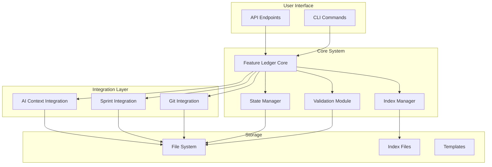
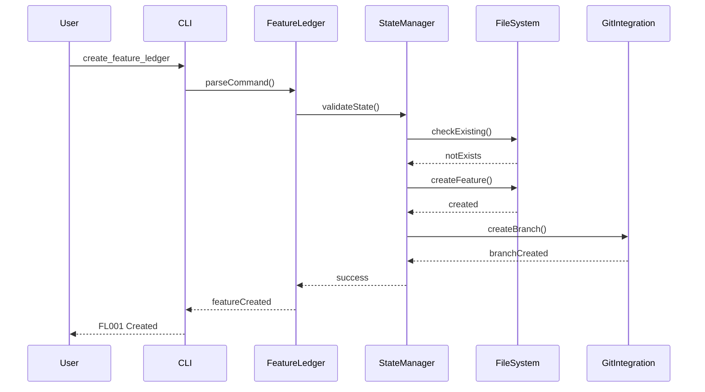
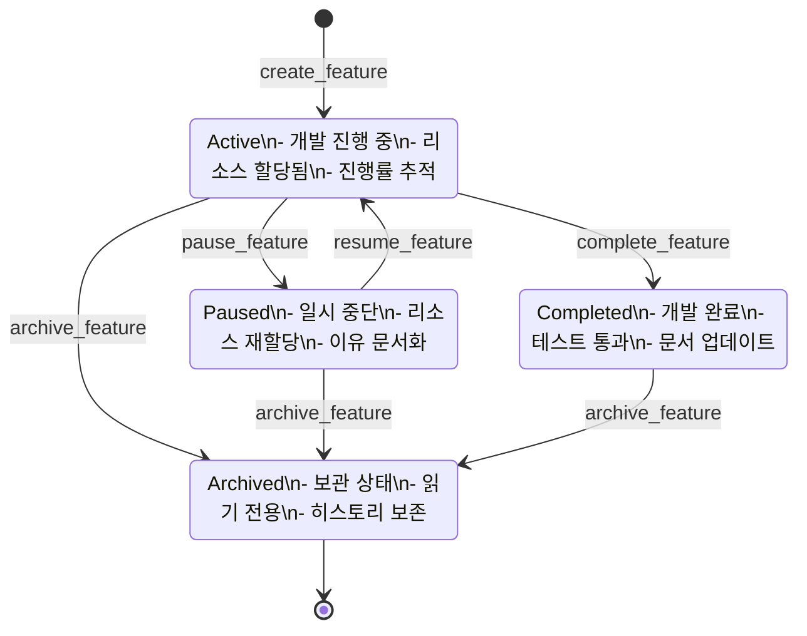
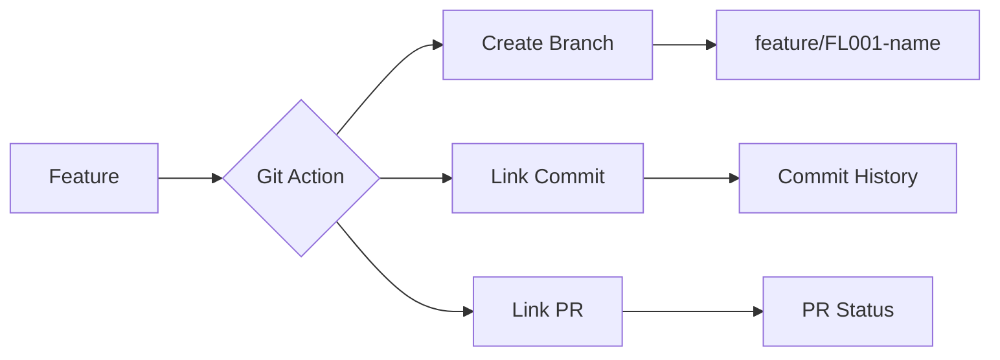
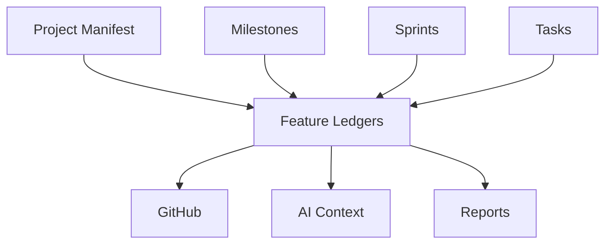

# Feature Ledger System Overview

## 시스템 개요

Feature Ledger System은 AIWF의 핵심 구성 요소로, 프로젝트의 모든 기능 개발을 추적하고 관리합니다. 이 시스템은 개발 프로세스의 투명성을 높이고, 팀 협업을 강화하며, 프로젝트 진행 상황을 실시간으로 파악할 수 있게 합니다.

## 아키텍처

### 시스템 구성도



### 데이터 플로우



### 상태 전이 다이어그램



## 핵심 구성 요소

### 1. Feature Ledger Core

시스템의 중앙 처리 엔진으로 다음 기능을 담당합니다:

- **명령어 파싱**: 사용자 입력을 해석하고 검증
- **비즈니스 로직**: Feature 생성, 업데이트, 상태 관리
- **이벤트 처리**: 상태 변경 시 관련 시스템에 알림

### 2. State Manager

Feature의 생명주기를 관리합니다:

- **상태 검증**: 유효한 상태 전환만 허용
- **히스토리 추적**: 모든 상태 변경 기록
- **일관성 보장**: 데이터 무결성 유지

### 3. Index Manager

빠른 검색과 조회를 위한 인덱싱 시스템:

- **실시간 인덱싱**: Feature 변경 시 즉시 업데이트
- **다중 인덱스**: ID, 상태, 태그, 담당자별 인덱스
- **성능 최적화**: 캐싱 및 증분 업데이트

### 4. Integration Modules

#### Git Integration


#### Sprint Integration
- Feature와 Sprint/Task의 양방향 연결
- 진행률 자동 계산
- 마일스톤 추적

#### AI Context Integration
- 활성 Feature를 AI 컨텍스트에 포함
- 토큰 효율을 위한 압축
- 관련 Feature 자동 제안

## 디렉토리 구조

```
.aiwf/06_FEATURE_LEDGERS/
├── active/                    # 진행 중인 Feature
│   ├── FL001_User_Auth.md
│   └── FL002_Dashboard.md
├── completed/                 # 완료된 Feature
│   └── FL000_Initial.md
├── archived/                  # 보관된 Feature
│   └── FL_Archive_2025Q1/
├── paused/                    # 일시 중단된 Feature
│   └── FL003_Analytics.md
├── FEATURE_LEDGER_INDEX.md    # 메인 인덱스
├── FEATURE_SCHEMA.md          # 데이터 스키마
├── FEATURE_STATE_DIAGRAM.md   # 상태 다이어그램
├── FEATURE_INTEGRATION_GUIDE.md # 통합 가이드
└── FEATURE_GIT_INTEGRATION.md # Git 통합 상세
```

## 데이터 모델

### Feature Entity

```yaml
# 핵심 식별 정보
feature_id: string (required, unique)
title: string (required)
status: enum [active, completed, paused, archived]
created_date: date
last_updated: datetime

# 프로젝트 연결
milestone: string
sprint_ids: array<string>
tasks: array<string>

# 팀 정보
assignee: string
contributors: array<string>
reviewers: array<string>

# 분류
priority: enum [critical, high, medium, low]
complexity: enum [simple, moderate, complex]
category: enum [feature, enhancement, bugfix, refactor]
tags: array<string>

# 시간 추적
estimated_hours: number
actual_hours: number
estimated_completion: date
actual_completion: date

# Git 통합
git_branch: string
git_commits: array<commit_hash>
pull_requests: array<pr_object>

# 의존성
depends_on: array<feature_id>
blocks: array<feature_id>

# 진행 상황
progress_percentage: number (0-100)
checklist_items_total: number
checklist_items_completed: number

# 리스크 관리
risk_level: enum [low, medium, high]
known_issues: array<string>
mitigation_plans: array<string>
```

## 통합 지점

### 1. AIWF 프로젝트 구조



### 2. 외부 시스템 연동

- **GitHub API**: PR, Issue, Commit 자동 연결
- **CI/CD**: 빌드 상태와 Feature 진행률 연동
- **프로젝트 관리 도구**: JIRA, Trello 등과 동기화 가능

## 성능 고려사항

### 인덱싱 성능

- 인덱스 업데이트: < 100ms
- Feature 검색: < 50ms (1000개 기준)
- 대시보드 생성: < 1s

### 확장성

- Feature 수: 10,000개까지 테스트됨
- 동시 사용자: 100명까지 지원
- 파일 크기: 각 Feature 최대 1MB

### 최적화 전략

1. **증분 업데이트**: 전체 재생성 대신 변경된 부분만 업데이트
2. **캐싱**: 자주 조회되는 데이터 메모리 캐싱
3. **비동기 처리**: 무거운 작업은 백그라운드에서 처리

## 보안 고려사항

### 접근 제어

- 파일 시스템 권한 기반
- Git 권한과 연동
- 민감 정보 마스킹

### 감사 추적

- 모든 변경사항 로깅
- 사용자별 활동 추적
- 변경 이력 보존

## 향후 로드맵

### Phase 1 (현재)
- ✅ 기본 CRUD 기능
- ✅ Git 통합
- ✅ Sprint/Task 연동
- ⏳ 대시보드 생성

### Phase 2 (계획)
- 📋 웹 UI 인터페이스
- 📋 고급 검색 기능
- 📋 자동화된 보고서
- 📋 AI 기반 인사이트

### Phase 3 (미래)
- 🔮 다국어 지원
- 🔮 플러그인 시스템
- 🔮 외부 도구 통합 API
- 🔮 모바일 앱 지원

## 관련 문서

- [API Reference](./FEATURE_LEDGER_API_REFERENCE.md)
- [User Guide](./FEATURE_LEDGER_USER_GUIDE.md)
- [Technical Specification](../02_REQUIREMENTS/M02_Context_Engineering_Enhancement/SPECS_Feature_Ledger_System.md)
- [Integration Guide](../06_FEATURE_LEDGERS/FEATURE_INTEGRATION_GUIDE.md)

---

*Feature Ledger System v1.0 - AIWF Project*