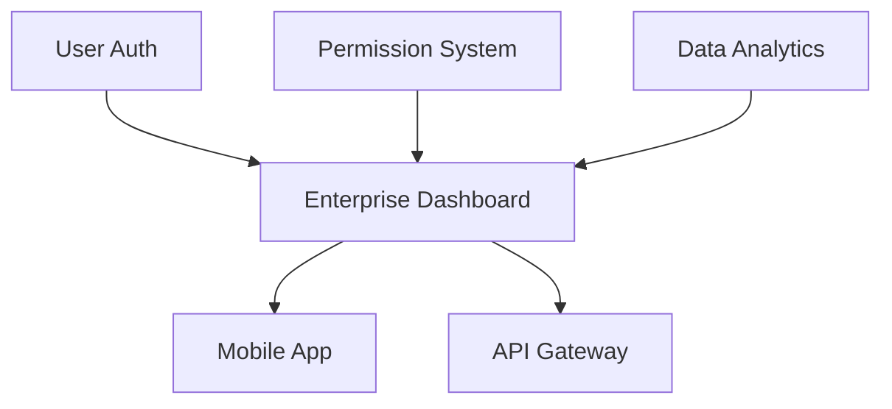

### Scenario
대규모 기능이 여러 스프린트에 걸쳐 개발되는 경우

### Implementation
```yaml

# FL004_Enterprise_Dashboard.md
sprint_ids: [S01_M02, S02_M02, S03_M02]
milestone: M02

# Sprint-specific tasks
sprint_breakdown:
  S01_M02:
   - "Foundation: Database schema, API design"
   - "Progress: 0% → 30%"
  S02_M02:
   - "Core Implementation: Backend APIs, basic UI"
   - "Progress: 30% → 70%"
  S03_M02:
   - "Polish: Advanced features, optimization"
   - "Progress: 70% → 100%"
```

### Sprint Tracking
```bash

# Sprint 시작 시
/project:aiwf:update_feature_progress FL004 30 --comment "S01 완료: DB 스키마 및 API 설계 완성"

# Sprint 중간 점검
/project:aiwf:feature_report sprint_progress --feature FL004
```

### Best Practices
- 각 스프린트별 명확한 deliverable 정의
- 스프린트 경계에서 통합 테스트
- 진행률은 전체 Feature 기준으로 관리

## 2. Cross-Team Feature Collaboration
프론트엔드, 백엔드, DevOps 팀이 함께 작업하는 경우

# Team assignment
assignee: tech_lead
contributors: [frontend_dev, backend_dev, devops_eng]
reviewers: [architect, qa_lead]

# Team-specific branches
team_branches:
  frontend: feature/FL005-frontend
  backend: feature/FL005-backend
  devops: feature/FL005-infra
```

# 팀별 브랜치 생성
/project:aiwf:feature_branch FL005 create --team frontend
/project:aiwf:feature_branch FL005 create --team backend

# 팀별 진행 상황 추적
/project:aiwf:update_feature_progress FL005 20 --team frontend --comment "UI 컴포넌트 50% 완성"
/project:aiwf:update_feature_progress FL005 15 --team backend --comment "API 엔드포인트 3/5 완성"

# 통합 상태 확인
/project:aiwf:feature_dashboard --feature FL005 --view team_breakdown
```

### Integration Points
```markdown

## Team Sync Points
- [ ] API Contract Agreement (Day 2)
- [ ] Frontend-Backend Integration Test (Day 5)
- [ ] DevOps Deployment Pipeline (Day 7)
- [ ] End-to-End Testing (Day 9)
- [ ] Production Deployment (Day 10)
```

## 3. Feature Flag Integration
점진적 롤아웃을 위한 Feature Flag 관리

# Feature metadata
feature_flags:
  name: "enterprise_dashboard_enabled"
  default_state: false
  rollout_plan:
   - stage: "internal"
   percentage: 5
   date: "2025-07-10"
   - stage: "beta"
   percentage: 25
   date: "2025-07-15"
   - stage: "ga"
   percentage: 100
   date: "2025-07-20"
```

```javascript
// Code example
if (featureFlags.isEnabled('enterprise_dashboard_enabled')) {
  return <EnterpriseDashboard />;
} else {
  return <LegacyDashboard />;
}
```

# Feature flag 상태 업데이트
/project:aiwf:update_feature_flag FL004 --stage beta --percentage 25

# 롤아웃 메트릭 확인
/project:aiwf:feature_report rollout_metrics --feature FL004
```

## 4. Dependency Management
복잡한 Feature 간 의존성 관리

### Dependency Graph


# FL004 dependencies
depends_on: [FL001, FL002, FL003]
blocks: [FL005, FL006]

# Dependency status tracking
dependency_status:
  FL001: completed
  FL002: completed
  FL003: in_progress  # 80% complete
```

# 의존성 체크
/project:aiwf:check_dependencies FL004

# Output:
✅ FL001: User Auth - Completed
✅ FL002: Permission System - Completed
⚠️ FL003: Data Analytics - In Progress (80%)
❌ Cannot start FL004 until all dependencies are completed

# 의존성 대시보드
/project:aiwf:feature_report dependencies --format mermaid
```

## 5. Performance Tracking
Feature의 성능 영향 추적

### Metrics Definition
performance_metrics:
  - metric: "API Response Time"
   baseline: 200ms
   target: 150ms
   current: 180ms
  - metric: "Page Load Time"
   baseline: 2.5s
   target: 2.0s
   current: 2.2s
  - metric: "Database Query Count"
   baseline: 15
   target: 10
   current: 12
```

# 성능 메트릭 업데이트
/project:aiwf:update_metrics FL004 --metric "API Response Time" --value 180ms

# 성능 리포트
/project:aiwf:feature_report performance --feature FL004
```

# CI/CD integration
performance_gates:
  - name: "API Response Time"
   threshold: 200ms
   action: "warn"
  - name: "Page Load Time"
   threshold: 3.0s
   action: "block"
```

## 6. Migration Features
레거시 시스템 마이그레이션 Feature

### Phased Approach
migration_phases:
  phase1:
   name: "Data Migration"
   status: completed
   duration: "5 days"
   rollback_tested: true
  phase2:
   name: "API Migration"
   status: in_progress
   duration: "7 days"
   rollback_tested: false
  phase3:
   name: "UI Migration"
   status: planned
   duration: "10 days"
```

### Phase 1 Rollback (Data)
1. Stop write operations
2. Run rollback script: `scripts/rollback_data_migration.sh`
3. Verify data integrity
4. Resume operations

### Phase 2 Rollback (API)
1. Switch load balancer to legacy endpoints
2. Clear cache
3. Monitor error rates
```

## 7. A/B Testing Features
새 기능의 효과를 A/B 테스트로 검증

ab_test_config:
  test_name: "new_checkout_flow"
  variants:
   control:
   name: "Legacy Checkout"
   percentage: 50
   feature_flag: false
   treatment:
   name: "New Checkout"
   feature_flag: true
  metrics:
   - conversion_rate
   - average_order_value
   - checkout_time
  duration: "14 days"
```

# A/B 테스트 결과 업데이트
/project:aiwf:update_ab_test FL007 --metric conversion_rate --control 2.3 --treatment 3.1

# 통계적 유의성 확인
/project:aiwf:feature_report ab_test_results --feature FL007
```

## 8. Security Features
보안 관련 Feature의 특별 관리

### Security Checklist
security_requirements:
  - requirement: "Security Design Review"
   reviewer: "security_team"
   date: "2025-07-08"
  - requirement: "Penetration Testing"
   status: scheduled
  - requirement: "OWASP Top 10 Compliance"
   checklist:
   - injection: passed
   - broken_auth: passed
   - sensitive_data: in_review
```

# 보안 체크리스트 업데이트
/project:aiwf:update_security_checklist FL008 --item "penetration_testing" --status completed

# 보안 컴플라이언스 리포트
/project:aiwf:feature_report security_compliance --feature FL008
```

## 9. Documentation-Heavy Features
API나 SDK처럼 문서가 중요한 Feature

### Documentation Tracking
documentation_requirements:
  - type: "API Reference"
   completeness: 70%
   location: "docs/api/v2"
  - type: "Integration Guide"
   completeness: 100%
   location: "docs/guides/integration"
  - type: "Code Examples"
   completeness: 0%
   languages: [javascript, python, java]
```

# API 문서 자동 생성
/project:aiwf:generate_docs FL009 --type api_reference

# 문서 완성도 확인
/project:aiwf:feature_report documentation --feature FL009
```

## 10. Feature Deprecation
기존 Feature를 단계적으로 폐기

### Deprecation Plan
deprecation_plan:
  announcement_date: "2025-07-01"
  deprecation_date: "2025-08-01"
  removal_date: "2025-09-01"
  migration_guide: "docs/migration/legacy_to_new.md"
  affected_users: 1250
  migration_status:
   notified: 1250
   migrated: 890
   pending: 360
```

# 폐기 공지 발송
/project:aiwf:send_deprecation_notice FL003 --channel email,in_app

# 마이그레이션 상태 추적
/project:aiwf:feature_report deprecation_status --feature FL003
```

## Best Practices Summary
1. *복잡도 관리*: Feature가 복잡해질수록 더 세분화된 추적 필요
2. *자동화 우선*: 반복 작업은 스크립트나 CI/CD로 자동화
3. *투명성 유지*: 모든 이해관계자가 상태를 쉽게 파악할 수 있도록
4. *데이터 기반 결정*: 메트릭과 로그를 기반으로 의사결정
5. *롤백 준비*: 항상 되돌릴 수 있는 계획 수립
---
*이 문서는 Feature Ledger의 고급 활용 사례를 다룹니다. 기본 사용법은 [User Guide][1]를 참조하세요.*

[1]: ./FEATURE_LEDGER_USER_GUIDE.md