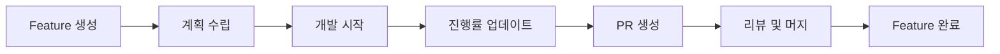

# Feature Ledger User Guide
## 목차
1. [소개][1]
2. [시작하기][2]
3. [기본 워크플로우][3]
4. [고급 사용법][4]
5. [통합 가이드][5]
6. [문제 해결][6]
7. [베스트 프랙티스][7]

## 소개
### Feature Ledger란?
Feature Ledger는 AIWF 프로젝트에서 기능 개발을 체계적으로 추적하고 관리하는 시스템입니다. 각 기능의 생명주기를 문서화하고, 진행 상황을 모니터링하며, 팀 협업을 향상시킵니다.

### 주요 이점
- *투명성*: 모든 기능의 상태를 한눈에 파악
- *추적성*: Git 커밋과 PR을 자동으로 연결
- *협업*: 팀원 간 작업 현황 공유
- *보고*: 자동화된 진행 상황 보고서
- *통합*: AIWF의 다른 시스템과 완벽히 통합

## 시작하기
### 1. 첫 번째 Feature Ledger 생성
새로운 기능 개발을 시작할 때:

```bash
/project:aiwf:create_feature_ledger user_registration --milestone M02 --sprint S01_M02 --priority high
```

결과:
```
✅ Feature Ledger created successfully!
Feature ID: FL001
Title: User Registration
Status: active
Location: .aiwf/06_FEATURE_LEDGERS/active/FL001_User_Registration.md
```

### 2. Feature 파일 구조 이해하기
생성된 Feature 파일을 열어보면:

```yaml
---
feature_id: FL001
created_date: 2025-07-09
milestone: M02
sprint_ids: [S01_M02]
priority: high
---
# Feature: User Registration
## Overview
[자동 생성된 템플릿]
```

### 3. Feature 정보 업데이트
기본 정보를 채워넣습니다:

1. Overview 섹션에 기능 설명 추가
2. Requirements에 구체적인 요구사항 나열
3. Technical Design에 구현 계획 작성

## 기본 워크플로우
### 개발 프로세스


### 1단계: Feature 생성 및 계획
# Feature 생성
/project:aiwf:create_feature_ledger payment_integration --milestone M02 --assignee "john_doe"

# 브랜치 생성
/project:aiwf:feature_branch FL002 create
```

### 2단계: 개발 중 진행률 추적
# 진행률 업데이트
/project:aiwf:update_feature_progress FL002 25 --hours 8

# 커밋 연결
git commit -m "feat(FL002): Implement payment gateway connection"
/project:aiwf:link_feature_commit FL002 --auto-progress
```

### 3단계: PR 및 완료
# PR 생성 및 연결
gh pr create --title "feat(FL002): Payment Integration"
/project:aiwf:link_feature_pr FL002 123

# Feature 완료
/project:aiwf:update_feature_status FL002 completed --comment "All tests passing"
```

## 고급 사용법
### 복잡한 Feature 관리
#### 의존성 설정
Feature 간 의존성이 있을 때:

# FL003 파일에서
depends_on: [FL001, FL002]  # 이 기능들이 먼저 완료되어야 함
blocks: [FL004, FL005]  # 이 Feature가 완료되어야 시작 가능
```

#### 하위 작업 분할
큰 Feature를 작은 단위로 나누기:

```markdown
## Implementation Plan
### Phase 1: Foundation (25%)
- [x] Database schema design
- [x] API specification
- [ ] Core business logic

### Phase 2: Integration (50%)
- [ ] External API integration
- [ ] Error handling
- [ ] Logging setup

### Phase 3: UI Implementation (25%)
- [ ] Component development
- [ ] Testing
- [ ] Documentation
```

### 대시보드 및 보고서
#### 실시간 대시보드
# 전체 현황
/project:aiwf:feature_dashboard

# 특정 마일스톤
/project:aiwf:feature_dashboard --milestone M02

# 개인별 현황
/project:aiwf:feature_dashboard --assignee "john_doe"
```

#### 상세 보고서
# 개발 속도 분석
/project:aiwf:feature_report velocity --milestone M02

# 번다운 차트
/project:aiwf:feature_report burndown --sprint S01_M02

# 의존성 그래프
/project:aiwf:feature_report dependencies --format html
```

### 검색 및 필터링
# 키워드 검색
/project:aiwf:feature_search "payment" --tags "backend,api"

# 날짜 범위 검색
/project:aiwf:feature_search "*" --date-range "2025-07-01:2025-07-31"

# 상태별 검색
/project:aiwf:feature_search "*" --status active --assignee "john_doe"
```

## 통합 가이드
### Git 워크플로우 통합
#### 1. 브랜치 전략
# Feature 브랜치 생성
/project:aiwf:feature_branch FL001 create
# → feature/FL001-user-registration
# 자동으로 체크아웃됨
git status
# On branch feature/FL001-user-registration
```

#### 2. 커밋 메시지 규칙
# Feature ID를 포함한 커밋
git commit -m "feat(FL001): Add email validation"
git commit -m "fix(FL001): Resolve password reset issue"
git commit -m "test(FL001): Add unit tests for registration"
```

#### 3. 자동 동기화
# Git 히스토리를 Feature Ledger와 동기화
/project:aiwf:feature_sync --direction git-to-ledger

# 양방향 동기화
/project:aiwf:feature_sync --direction both
```

### Sprint/Task 통합
#### Feature와 Task 연결
# Feature 파일에서
tasks: [T01_S01, T02_S01, T03_S01]

# Task 파일에서
```

#### 진행률 자동 계산
Task 완료 시 Feature 진행률이 자동 업데이트됩니다:

```
Tasks completed: 2/3 → Feature progress: 67%
```

### CI/CD 통합
#### GitHub Actions 예제
name: Feature Ledger Update
on:
  pull_request:
   types: [opened, merged]

jobs:
  update-feature:
   runs-on: ubuntu-latest
   steps:
   - uses: actions/checkout@v2
   - name: Extract Feature ID
   run: |
   FEATURE_ID=$(echo "${{ github.event.pull_request.title }}" | grep -oP 'FL\d{3}')
   echo "FEATURE_ID=$FEATURE_ID" >> $GITHUB_ENV
   - name: Update Feature Status
   if: github.event.pull_request.merged == true
   npx aiwf update_feature_status $FEATURE_ID completed
```

## 문제 해결
### 일반적인 문제
#### 1. Feature ID 중복
*문제*: "Error E003: Duplicate feature ID"

*해결책*:
# 현재 사용 중인 ID 확인
cat .aiwf/06_FEATURE_LEDGERS/FEATURE_LEDGER_INDEX.md | grep "Last assigned ID"

# 다음 번호 사용
/project:aiwf:create_feature_ledger new_feature
```

#### 2. 잘못된 상태 전환
*문제*: "Error E002: Invalid status transition"

- `archived` 상태는 되돌릴 수 없음
- `completed` → `active`는 불가능
- 필요시 새 Feature 생성

#### 3. Git 동기화 실패
*문제*: "Error E004: Git integration failed"

# Git 상태 확인
# 스테이징된 변경사항 커밋
git add .
git commit -m "Save work before feature sync"

# 다시 시도
/project:aiwf:feature_sync
```

### 디버깅 팁
#### 로그 확인
# Feature 활동 로그
tail -f .aiwf/logs/feature_ledger.log

# 특정 Feature 히스토리
grep "FL001" .aiwf/logs/feature_ledger.log
```

#### 수동 복구
# 인덱스 재구성
/project:aiwf:feature_index --rebuild

# 무결성 검사
/project:aiwf:feature_validate --fix
```

## 베스트 프랙티스
### 1. Feature 생성 시점
- ✅ 개발 시작 전 생성
- ✅ 요구사항이 명확해졌을 때
- ❌ 개발 완료 후 생성
- ❌ 너무 세분화된 작업

### 2. 진행률 관리
# 좋은 예: 구체적인 진행 사항과 함께
/project:aiwf:update_feature_progress FL001 40 --comment "API endpoints completed"

# 나쁜 예: 설명 없이
/project:aiwf:update_feature_progress FL001 40
```

### 3. 커밋 메시지
# 좋은 예
git commit -m "feat(FL001): Implement JWT authentication with refresh tokens"

# 나쁜 예
git commit -m "Update auth"  # Feature ID 없음
git commit -m "FL001"  # 설명 없음
```

### 4. Feature 범위
*적절한 Feature 크기*:
- 1-2주 내 완료 가능
- 명확한 비즈니스 가치
- 독립적으로 배포 가능

*피해야 할 것*:
- 너무 큰 범위 (예: "전체 시스템 리팩토링")
- 너무 작은 범위 (예: "버튼 색상 변경")
- 모호한 목표

### 5. 팀 협업
## 일일 스탠드업에서
"FL001 진행률 70%, 오늘 인증 로직 완료 예정"

## PR 리뷰에서
"FL001의 요구사항 3번이 구현되지 않았습니다"

## 스프린트 회고에서
"FL001이 예상보다 복잡해서 2개 Feature로 분할 필요"
```

### 6. 문서화
Feature Ledger 자체가 문서이므로:

1. *실시간 업데이트*: 변경사항 즉시 반영
2. *상세 기록*: 의사결정 과정 포함
3. *링크 활용*: 관련 문서, PR, 이슈 연결
4. *시각적 자료*: 다이어그램, 스크린샷 추가

## 다음 단계
1. [API Reference][8] - 모든 명령어 상세 정보
2. [Architecture Guide][9] - 시스템 구조 이해
3. [Integration Examples][10] - 실제 통합 예제
---
*이 가이드는 AIWF Feature Ledger System v1.0 기준으로 작성되었습니다.*

[1]: #소개
[2]: #시작하기
[3]: #기본-워크플로우
[4]: #고급-사용법
[5]: #통합-가이드
[6]: #문제-해결
[7]: #베스트-프랙티스
[8]: ./FEATURE_LEDGER_API_REFERENCE.md
[9]: ../02_REQUIREMENTS/M02_Context_Engineering_Enhancement/SPECS_Feature_Ledger_System.md
[10]: ../06_FEATURE_LEDGERS/FEATURE_INTEGRATION_GUIDE.md