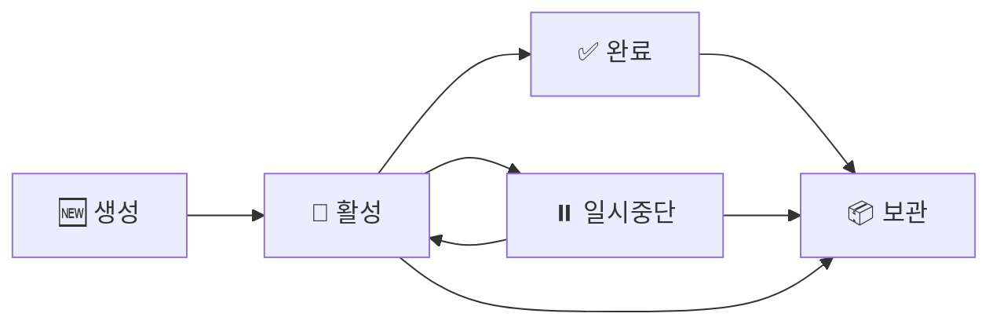

## Feature Ledger란?
Feature Ledger는 AIWF 프로젝트에서 기능 개발의 전체 생명주기를 추적하고 관리하는 시스템입니다. 각 기능의 계획부터 완료까지 모든 과정을 문서화하고, Git과 연동하여 개발 진행 상황을 실시간으로 파악할 수 있습니다.

### 1. 첫 Feature 생성하기
새로운 기능 개발을 시작할 때:

```bash
/project:aiwf:create_feature_ledger 사용자_인증_시스템 --milestone M02 --priority high
```

생성된 Feature 파일 확인:
cat .aiwf/06_FEATURE_LEDGERS/active/FL001_사용자_인증_시스템.md
```

### 2. Feature 정보 채우기
생성된 파일을 열어 다음 정보를 추가합니다:

```markdown

## Overview
사용자 인증 시스템은 JWT 기반의 로그인/로그아웃 기능을 제공합니다.
이메일 인증과 소셜 로그인을 지원하며, 보안 강화를 위한 2FA도 포함됩니다.

## Requirements
- [x] 이메일/비밀번호 로그인
- [x] JWT 토큰 발급 및 검증
- [ ] 소셜 로그인 (Google, GitHub)
- [ ] 2단계 인증 (2FA)
- [ ] 비밀번호 재설정
```

### 3. 개발 시작하기
Feature 브랜치 생성:
/project:aiwf:feature_branch FL001 create

# → feature/FL001-사용자-인증-시스템 브랜치 생성 및 체크아웃
```

### 4. 진행 상황 추적하기
개발하면서 진행률 업데이트:

# 진행률 업데이트
/project:aiwf:update_feature_progress FL001 30 --comment "로그인 API 완성"

# 커밋과 연결
git commit -m "feat(FL001): JWT 토큰 발급 로직 구현"
/project:aiwf:link_feature_commit FL001
```

### 5. 완료 처리하기
모든 요구사항이 완료되면:
/project:aiwf:update_feature_status FL001 completed --comment "모든 테스트 통과, 문서화 완료"
```

### Feature 생명주기


### Feature 크기 가이드
적절한 Feature 범위:
- ⭐ *좋은 예*: "사용자 인증 시스템", "대시보드 리디자인", "결제 시스템 통합"
- ❌ *나쁜 예*: "버튼 색상 변경", "전체 앱 리팩토링", "버그 수정"

### 디렉토리 구조
```
.aiwf/06_FEATURE_LEDGERS/
├── active/  # 🚀 진행 중
├── completed/  # ✅ 완료됨
├── paused/  # ⏸️ 일시중단
└── archived/  # 📦 보관됨
```

# 1. Feature 생성
/project:aiwf:create_feature_ledger 상품_검색_API --milestone M02 --assignee "김개발"

# 2. 요구사항 정의 (파일 편집)
- [ ] 키워드 검색 API
- [ ] 필터링 기능 (카테고리, 가격대)
- [ ] 정렬 옵션 (인기순, 가격순, 최신순)
- [ ] 페이지네이션

# 3. 개발 진행
git checkout -b feature/FL002-상품-검색-API

# 4. 진행률 업데이트
/project:aiwf:update_feature_progress FL002 50 --comment "검색 로직 구현 완료"

# 5. PR 생성 및 연결
gh pr create --title "feat(FL002): 상품 검색 API 구현"
/project:aiwf:link_feature_pr FL002 123
```

# 1. Feature 생성 (태그 포함)
/project:aiwf:create_feature_ledger 반응형_네비게이션 --tags "frontend,ui,responsive"

### Phase 1: 데스크톱 레이아웃 (30%)
- [x] 메뉴 구조 설계
- [ ] 스타일링
- [ ] 애니메이션

### Phase 2: 모바일 최적화 (40%)
- [ ] 햄버거 메뉴
- [ ] 터치 제스처
- [ ] 성능 최적화

### Phase 3: 테스트 및 문서화 (30%)
- [ ] 크로스 브라우저 테스트
- [ ] 스토리북 문서
- [ ] 사용 가이드
```

### 일일 스탠드업에서
"FL001 사용자 인증 - 진행률 70%
 - 어제: JWT 리프레시 토큰 구현
 - 오늘: 소셜 로그인 통합
 - 블로커: OAuth 설정 관련 DevOps 팀 지원 필요"
```

# PR 설명에 Feature 참조
PR 제목: feat(FL001): 소셜 로그인 구현

본문:

### 구현 내용
- Google OAuth 2.0 통합
- GitHub 로그인 지원
- 기존 계정과 소셜 계정 연동

### 체크리스트
- [x] 단위 테스트
- [x] 통합 테스트
- [x] 문서 업데이트
```

### 스프린트 회고에서
대시보드로 전체 현황 파악:
/project:aiwf:feature_dashboard --sprint S01_M02

## Sprint S01_M02 Features
- FL001: 사용자 인증 [90%] ⚠️ 1일 지연
- FL002: 상품 검색 API [100%] ✅ 완료
- FL003: 결제 시스템 [30%] 🚀 진행 중
```

### 1. 자동화 활용
Git Hook 설정 (`.git/hooks/prepare-commit-msg`):

# Feature ID 자동 추가
BRANCH=$(git rev-parse --abbrev-ref HEAD)
FEATURE_ID=$(echo $BRANCH | grep -oP 'FL\d{3}')

if [ ! -z "$FEATURE_ID" ]; then
   sed -i "1s/^/feat($FEATURE_ID): /" $1
fi
```

### 2. 템플릿 활용
자주 사용하는 Feature 유형별 템플릿 준비:
- `api_feature_template.md` - API 개발용
- `ui_feature_template.md` - UI 컴포넌트용
- `bugfix_feature_template.md` - 버그 수정용

# 내가 담당한 활성 Feature
/project:aiwf:feature_search "*" --assignee "나" --status active

# 이번 주 완료된 Feature
/project:aiwf:feature_search "*" --date-range "2025-07-01:2025-07-07" --status completed

# 높은 우선순위 Feature
/project:aiwf:feature_search "*" --priority critical,high
```

## 다음 단계
1. *상세 문서 읽기*
   - [API 레퍼런스][1] - 모든 명령어 상세 설명
   - [사용자 가이드][2] - 고급 기능과 통합
   - [FAQ][3] - 자주 묻는 질문과 문제 해결

2. *실습하기*
   - 테스트 Feature 생성해보기
   - Git 통합 연습하기
   - 대시보드 생성해보기

3. *팀과 공유하기*
   - 팀 규칙 정하기 (Feature 크기, 명명 규칙 등)
   - 워크플로우 문서화
   - 정기 리뷰 프로세스 수립
---
*🚀 Feature Ledger로 더 체계적인 개발을 시작하세요!*

[1]: ./FEATURE_LEDGER_API_REFERENCE.md
[2]: ./FEATURE_LEDGER_USER_GUIDE.md
[3]: ./FEATURE_LEDGER_FAQ.md