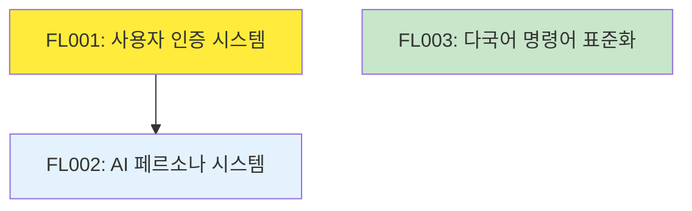

# Feature Ledger 인덱스

## 개요

이 문서는 AIWF 프로젝트의 모든 Feature를 중앙에서 관리하는 인덱스입니다. Feature의 현재 상태, 진행률, 의존성을 한눈에 파악할 수 있습니다.

**최종 업데이트**: 2025-07-08 20:56  
**총 Feature 수**: 3개  
**활성 Feature**: 2개  
**완료 Feature**: 1개  

## Feature 통계

### 상태별 분포
| 상태 | 개수 | 비율 |
|------|------|------|
| draft | 1 | 33% |
| active | 1 | 33% |
| completed | 1 | 33% |
| on-hold | 0 | 0% |
| archived | 0 | 0% |

### 우선순위별 분포
| 우선순위 | 개수 | 비율 |
|----------|------|------|
| high | 2 | 67% |
| medium | 1 | 33% |
| low | 0 | 0% |
| critical | 0 | 0% |

### 마일스톤별 분포
| 마일스톤 | 개수 | 상태 |
|----------|------|------|
| M01 | 1 | 완료 |
| M02 | 2 | 진행 중 |

## Feature 목록

### 🟢 Active Features

#### [FL001] 사용자 인증 시스템 `active` `high`
- **담당자**: moonklabs
- **마일스톤**: M02
- **진행률**: 33% (8/24h)
- **태그**: authentication, security, core, backend
- **브랜치**: feature/FL001-user-auth-system
- **설명**: JWT 기반 사용자 인증 시스템 구현으로 보안 강화 및 세션 관리 개선
- **파일**: [FL001_사용자_인증_시스템.md](active/FL001_사용자_인증_시스템.md)

#### [FL002] AI 페르소나 시스템 `draft` `high`
- **담당자**: team-ai
- **마일스톤**: M02
- **진행률**: 0% (0/32h)
- **태그**: ai, persona, context, enhancement, core
- **의존성**: FL001
- **설명**: 5개의 전문 AI 페르소나를 통한 컨텍스트 특화 개발 지원 시스템
- **파일**: [FL002_ai_페르소나_시스템.md](active/FL002_ai_페르소나_시스템.md)

### ✅ Completed Features

#### [FL003] 다국어 명령어 표준화 `completed` `medium`
- **담당자**: moonklabs
- **마일스톤**: M01
- **완료일**: 2025-07-08
- **작업시간**: 18/16h (+2h)
- **태그**: i18n, localization, command, standardization, completed
- **브랜치**: feature/FL003-multilang-commands, hotfix/FL003-korean-encoding
- **설명**: 한국어/영어 명령어 시스템 통합 및 표준화로 글로벌 사용자 지원
- **파일**: [FL003_다국어_명령어_표준화.md](completed/FL003_다국어_명령어_표준화.md)

## 의존성 그래프



**범례**:
- 🟡 Active (진행 중)
- 🔵 Draft (기획 완료)
- 🟢 Completed (완료)

## 마일스톤별 현황

### M01 - 한국어 명령어 표준화 ✅
- **상태**: 완료
- **Feature 수**: 1개
- **완료율**: 100%
- **주요 성과**: 글로벌 사용자 기반 확대

### M02 - Context Engineering Enhancement 🔄
- **상태**: 진행 중
- **Feature 수**: 2개
- **완료율**: 0%
- **예상 완료**: 2025-07-15
- **핵심 Feature**: FL001 (사용자 인증), FL002 (AI 페르소나)

## 최근 활동

### 2025-07-08
- ✅ **FL003** 다국어 명령어 표준화 완료
- 🔄 **FL001** 사용자 인증 시스템 활성화 (33% 진행)
- 📋 **FL002** AI 페르소나 시스템 기획 완료

### 향후 계획
- **2025-07-09**: FL001 Phase 1 완료 예정
- **2025-07-10**: FL002 개발 시작 예정
- **2025-07-15**: M02 마일스톤 완료 목표

## Feature 관리 명령어

### 조회 명령어
```bash
# 전체 Feature 목록
/aiwf_list_features

# 상태별 조회
/aiwf_list_features --status active
/aiwf_list_features --status completed

# 마일스톤별 조회
/aiwf_list_features --milestone M02

# 특정 Feature 상세 조회
/aiwf_feature_details FL001
```

### 관리 명령어
```bash
# 새 Feature 생성
/aiwf_create_feature_ledger "제목" "설명"

# 상태 업데이트
/aiwf_update_feature_status FL001 completed

# 의존성 추가
/aiwf_add_dependency FL002 FL001

# 인덱스 업데이트
/aiwf_update_feature_index
```

## 품질 메트릭

### 계획 정확도
- **시간 예측 정확도**: 89% (FL003: 예상 16h vs 실제 18h)
- **완료율 예측**: 진행 중 (FL001, FL002)
- **의존성 관리**: 100% (순환 참조 없음)

### 생산성 지표
- **평균 Feature 크기**: 24시간
- **완료 소요 시간**: 평균 6일 (FL003 기준)
- **재작업률**: 11% (FL003: +2시간)

## 위험 요소 및 대응

### 현재 위험 요소
1. **FL002 의존성**: FL001 완료 지연 시 FL002 시작 지연 가능
2. **M02 일정**: 2개 Feature의 병렬 진행 필요
3. **리소스 할당**: team-ai의 FL002 전담 필요

### 대응 방안
- FL001 Phase 1 우선 완료로 FL002 시작 가능
- 일주일 스프린트 단위로 진행 모니터링
- 필요시 Feature 범위 조정

## 관련 문서

- [Feature Ledger 시스템 가이드](README.md)
- [Feature 워크플로우](FEATURE_WORKFLOW.md)
- [메타데이터 정의](FEATURE_METADATA.md)
- [ID 생성 규칙](FEATURE_ID_GENERATOR.md)
- [스키마 검증](schemas/feature_schema.json)

---

*이 인덱스는 Feature 생성/수정 시 자동으로 업데이트됩니다.*  
*수동 업데이트: `/aiwf_update_feature_index`*

**생성일**: 2025-07-08 20:56  
**관리자**: moonklabs