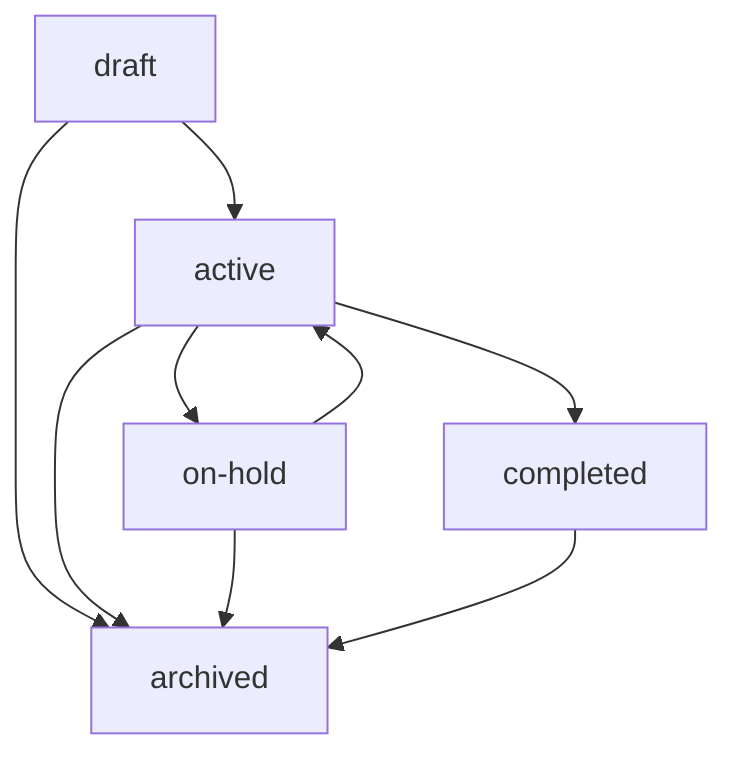

# Feature 상태 워크플로우

## 개요

Feature Ledger 시스템에서 각 Feature는 명확한 상태를 가지며, 정의된 워크플로우에 따라 상태가 전환됩니다.

## Feature 상태 정의

### 1. draft (초안)
- **설명**: 아이디어 단계, 기본 기획 완료
- **특징**: 구체적인 구현 계획 미완성
- **디렉토리**: `active/` (개발 대기 상태)
- **다음 상태**: `active`, `archived`

### 2. active (활성)
- **설명**: 현재 개발 중인 Feature
- **특징**: 실제 구현 작업 진행 중
- **디렉토리**: `active/`
- **다음 상태**: `on-hold`, `completed`, `archived`

### 3. on-hold (일시중단)
- **설명**: 일시적으로 개발이 중단된 Feature
- **특징**: 외부 요인이나 우선순위 변경으로 대기
- **디렉토리**: `active/` (재개 대기 상태)
- **다음 상태**: `active`, `archived`

### 4. completed (완료)
- **설명**: 개발이 완료되어 배포된 Feature
- **특징**: 모든 요구사항 충족, 테스트 완료
- **디렉토리**: `completed/`
- **다음 상태**: `archived`

### 5. archived (아카이브)
- **설명**: 장기 보관을 위해 아카이브된 Feature
- **특징**: 취소되거나 오래된 완료 Feature
- **디렉토리**: `archived/`
- **다음 상태**: 없음 (최종 상태)

## 상태 전환 워크플로우



## 상태 전환 규칙

### 1. draft → active
- **조건**: 구현 계획 완성, 담당자 할당
- **필수 업데이트**: `assignee`, `estimated_hours`
- **검증**: 의존성 Feature 상태 확인

### 2. active → on-hold
- **조건**: 외부 블로커, 우선순위 변경
- **필수 업데이트**: 중단 사유 기록
- **알림**: 담당자 및 관련자 통지

### 3. active → completed
- **조건**: 모든 요구사항 충족, 테스트 통과
- **필수 업데이트**: `actual_hours`, 완료 일시
- **후속 작업**: `completed/` 디렉토리로 이동

### 4. on-hold → active
- **조건**: 블로커 해결, 우선순위 복구
- **필수 업데이트**: 재개 일시, 담당자 확인
- **검증**: 현재 상황과 계획 일치성 확인

### 5. 모든 상태 → archived
- **조건**: 프로젝트 취소, 장기 보관 필요
- **필수 업데이트**: 아카이브 사유 기록
- **후속 작업**: `archived/` 디렉토리로 이동

## 디렉토리 이동 규칙

### 1. 파일 이동 시점
- **completed 상태**: 즉시 `completed/` 이동
- **archived 상태**: 즉시 `archived/` 이동
- **기타 상태**: `active/` 유지

### 2. 이동 시 검증
- 파일 무결성 확인
- 참조 링크 업데이트
- 인덱스 파일 갱신

## 상태 관리 명령어

### 1. 상태 조회
```bash
# 특정 Feature 상태 확인
/aiwf_feature_status FL001

# 상태별 Feature 목록
/aiwf_list_features --status active
/aiwf_list_features --status completed
```

### 2. 상태 변경
```bash
# 상태 변경
/aiwf_update_feature_status FL001 active
/aiwf_update_feature_status FL001 completed "모든 요구사항 완료"

# 일괄 상태 변경
/aiwf_bulk_update_status --milestone M02 --from draft --to active
```

### 3. 워크플로우 검증
```bash
# 상태 전환 가능성 확인
/aiwf_validate_transition FL001 completed

# 의존성 체크
/aiwf_check_dependencies FL001
```

## 자동화 규칙

### 1. Git 연동
- **브랜치 생성**: `draft` → `active` 시 자동 브랜치 생성
- **PR 머지**: 자동으로 `completed` 상태로 전환
- **브랜치 삭제**: `archived` 시 관련 브랜치 정리

### 2. 시간 추적
- **시작 시간**: `active` 상태 진입 시 자동 기록
- **완료 시간**: `completed` 상태 진입 시 자동 기록
- **작업 시간**: Git 커밋 기반 자동 계산

### 3. 알림 시스템
- **상태 변경**: 담당자에게 자동 알림
- **의존성 해결**: 대기 중인 Feature에 알림
- **일정 지연**: 예상 시간 초과 시 경고

## 메트릭 및 리포팅

### 1. 상태별 통계
```yaml
feature_statistics:
  total: 25
  draft: 5
  active: 8
  on_hold: 2
  completed: 8
  archived: 2
```

### 2. 워크플로우 메트릭
- 평균 개발 시간 (draft → completed)
- 완료율 (completed / total)
- 중단율 (archived / total)

### 3. 성능 지표
- 예상 vs 실제 시간 정확도
- 의존성 해결 속도
- 상태 전환 빈도

## 예외 처리

### 1. 잘못된 상태 전환
- 비허용 전환 시 오류 메시지
- 이전 상태로 롤백 옵션
- 관리자 강제 전환 기능

### 2. 의존성 충돌
- 순환 의존성 감지
- 의존성 미해결 경고
- 자동 의존성 정렬

### 3. 파일 시스템 오류
- 디렉토리 이동 실패 시 복구
- 백업을 통한 상태 복원
- 수동 수정을 위한 가이드

---

*생성일: 2025-07-08*
*최종 업데이트: 2025-07-08 20:55*