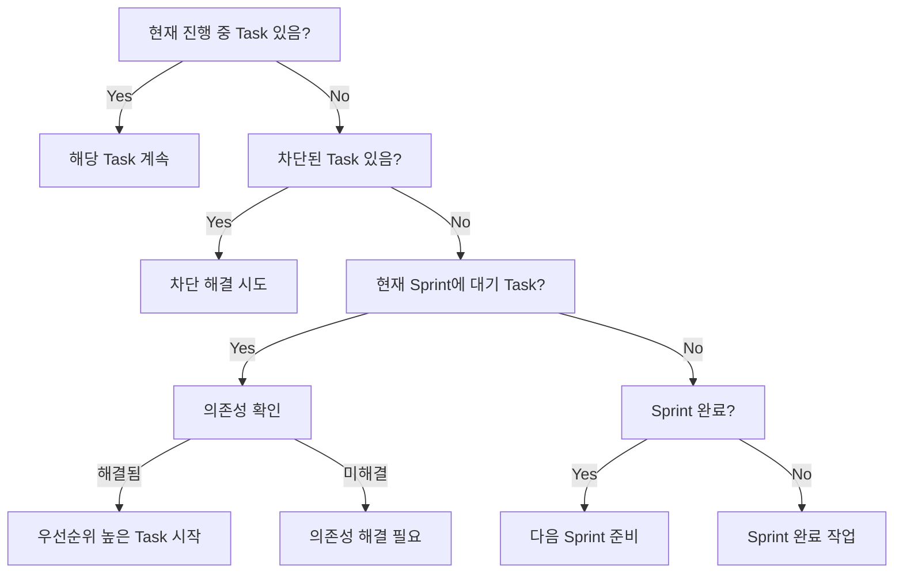

# 스마트 다음 액션 결정

워크플로우 규칙과 현재 상태를 분석하여 AI가 수행해야 할 최적의 다음 작업을 결정합니다. 단순한 Task 나열이 아닌, 전체 프로젝트 맥락에서 가장 효과적인 작업을 제안합니다.

## 핵심 기능

- **워크플로우 준수**: Milestone → Sprint → Task 계층 구조 존중
- **의존성 해결**: 실행 가능한 작업만 제안
- **우선순위 계산**: 다차원 점수 기반 최적 작업 선택
- **자동 전환**: Sprint/Milestone 경계에서 적절한 전환 제안

## 실행 프로세스

### 1. 컨텍스트 로드 및 분석

**필수 데이터 수집:**
```javascript
// 1. 현재 상태 로드
const stateIndex = loadStateIndex();
const workflowRules = loadWorkflowRules();
const currentContext = loadWorkflowContext();

// 2. 현재 위치 파악
const position = {
  milestone: "M01",
  sprint: "S02", 
  activeTasks: ["T03_S02_M01"],
  phase: "implementation"
};
```

### 2. 실행 가능성 분석

**각 대기 중 Task에 대한 검증:**

```javascript
for (const task of pendingTasks) {
  const canExecute = checkExecutability(task);
  
  // 실행 가능성 체크리스트
  canExecute.sameSpring = (task.sprint === currentSprint);
  canExecute.dependenciesMet = checkDependencies(task);
  canExecute.resourcesAvailable = checkResources(task);
  canExecute.noBlockers = !hasBlockers(task);
  
  if (canExecute.all()) {
    executableTasks.push(task);
  }
}
```

### 3. 우선순위 점수 계산

**다차원 우선순위 매트릭스:**

```
점수 = (우선순위 × 3) + (의존성 × 2) + (Sprint 목표 × 2) + (긴급도 × 1)

예시:
T04: (High × 3) + (Blocking × 2) + (Critical × 2) + (Soon × 1) = 9 + 6 + 6 + 2 = 23점
T05: (Medium × 2) + (Dependent × 1) + (Important × 2) + (Later × 1) = 6 + 2 + 4 + 1 = 13점
```

### 4. 의사결정 트리 실행

**체계적인 결정 프로세스:**



### 5. 컨텍스트 기반 추천 생성

**상황별 맞춤 추천:**

#### Case 1: 진행 중 Task 있음
```markdown
## 🎯 추천: 현재 Task 완료에 집중

**주 작업**: T03_S02_M01 - 사용자 인증 API 구현 (45% 완료)

**다음 단계**:
1. register endpoint 유효성 검사 구현 (1.5시간)
2. 에러 처리 로직 추가 (1시간)
3. 단위 테스트 작성 (2시간)

**완료 시 효과**:
- T04, T05 시작 가능 (의존성 해결)
- Sprint S02 진행률 40% → 70%
- 핵심 기능 블로킹 해소

**권장 집중 시간**: 4-5시간 집중 작업으로 완료 가능
```

#### Case 2: Sprint 전환 필요
```markdown
## 🔄 추천: Sprint 전환 준비

**현재 상황**: S02 완료 (100%), S03 미준비

**즉시 실행**:
1. S02 Sprint 리뷰 문서 작성 (30분)
2. 완료된 기능 통합 테스트 (1시간)
3. S03 요구사항 분석 (1시간)

**S03 준비 작업**:
1. 테스트 계획 수립
2. Task 분할 및 생성
3. 리소스 할당 계획

**자동 실행**: /aiwf:transition S02 → S03
```

#### Case 3: 병렬 실행 가능
```markdown
## ⚡ 추천: 병렬 Task 실행

**동시 실행 가능 Task**:
- T06: 프론트엔드 로그인 폼 (독립적)
- T07: API 문서 작성 (독립적)
- T08: 데이터베이스 인덱스 최적화 (독립적)

**실행 전략**:
1. 주 작업: T06 (개발 집중)
2. 부 작업: T07 (틈틈이 문서화)
3. 백그라운드: T08 (자동화 스크립트)

**예상 시간 단축**: 순차 12시간 → 병렬 6시간
```

### 6. 장애물 및 위험 분석

**선제적 문제 해결:**

```markdown
## ⚠️ 주의 필요 사항

### 즉시 해결 필요
1. **T09 차단**: API 권한 문제
   - 해결방안: 관리자에게 권한 요청
   - 예상 지연: 1-2일

### 잠재적 위험
1. **S03 Task 미생성**
   - 위험: Sprint 시작 지연
   - 조치: S02 80% 시점에서 미리 준비

2. **M01 기한 임박**
   - 남은 기간: 10일
   - 필요 작업: 15 Tasks
   - 권장: 일일 2 Task 완료 목표

### 의존성 체인
T03 → T04 → T05 → T10
- T03 지연 시 전체 체인 영향
- 버퍼 시간 확보 필요
```

### 7. 실행 계획 생성

**구체적인 실행 로드맵:**

```markdown
## 📋 실행 계획

### 오늘 (Day 1)
- [ ] 09:00-11:00: T03 register endpoint 완성
- [ ] 11:00-12:00: T03 단위 테스트
- [ ] 14:00-15:00: T03 코드 리뷰 및 마무리
- [ ] 15:00-17:00: T04 시작 (API 문서화)

### 내일 (Day 2)
- [ ] T04 완료
- [ ] T05 시작
- [ ] S03 계획 회의

### 주간 목표
- [ ] S02 완료 (현재 40% → 100%)
- [ ] S03 Task 생성 및 30% 진행
- [ ] M01 전체 진행률 70% → 85%
```

## 출력 형식

```
🤖 스마트 다음 액션 분석 중...

📊 현재 상황 분석:
- 위치: M01 > S02 > T03
- 진행 중: 1개 Task (T03)
- 대기 중: 4개 Tasks
- 실행 가능: 1개 Task

🎯 최우선 추천 액션:

1️⃣ T03 완료 (우선순위: 🔴 높음)
   📍 현재: register endpoint 구현 중
   ⏱️ 예상: 4시간
   🎯 목표: API 핵심 기능 완성
   💡 이유: 3개 Task가 이것을 기다림

2️⃣ T04 준비 (우선순위: 🟡 중간)
   📍 조건: T03 완료 후
   ⏱️ 예상: 3시간
   🎯 목표: API 문서화
   💡 이유: 프론트엔드 개발 시작 가능

3️⃣ S03 계획 (우선순위: 🟢 낮음)
   📍 조건: S02 80% 완료
   ⏱️ 예상: 2시간
   🎯 목표: 테스트 Sprint 준비
   💡 이유: Sprint 전환 지연 방지

⚡ 병렬 가능: T07 (문서 작성)

⚠️ 주의: T05는 T04 완료 필수

📈 예상 효과:
- Sprint 진행률: 40% → 70%
- 블로킹 해소: 3개 Task
- 일정 준수율: 95%
```

## 고급 기능

### 1. 학습 기반 추천
```javascript
// AI 작업 패턴 학습
const patterns = {
  preferredWorkingHours: "10:00-14:00",
  averageTaskCompletion: "4.5 hours",
  strongSkills: ["backend", "api"],
  improvementAreas: ["frontend", "testing"]
};

// 패턴 기반 추천 조정
recommendations.adjust(patterns);
```

### 2. 리스크 기반 우선순위
```javascript
// 리스크 점수 추가
riskScore = impactIfDelayed × probabilityOfDelay;
finalScore = priorityScore + (riskScore × 0.5);
```

### 3. 팀 협업 고려
```javascript
// 다른 팀원 작업 고려
if (teamMember.working_on === "frontend") {
  prioritize("backend_tasks");
  suggest("api_documentation"); // 협업 지원
}
```

## 사용 시나리오

### 1. 일일 작업 시작
```bash
# 아침 작업 시작
/aiwf:update_state
/aiwf:workflow_context
/aiwf:next_action
# → 오늘의 최적 작업 순서 제공
```

### 2. Task 완료 후
```bash
# Task 완료
/aiwf:complete_task T03

# 다음 작업 결정
/aiwf:next_action
# → 의존성 해결된 새 작업 제안
```

### 3. 주간 계획
```bash
# 주간 계획 수립
/aiwf:next_action --timeline week
# → 주간 단위 작업 계획 생성
```

## 관련 명령어

- `/aiwf:workflow_context` - 워크플로우 컨텍스트 로드
- `/aiwf:do_task` - 추천된 Task 실행
- `/aiwf:transition` - Sprint/Milestone 전환
- `/aiwf:update_state` - 상태 업데이트

이 명령어는 AI가 단순히 Task를 나열하는 것이 아니라, 프로젝트의 전체 맥락에서 가장 효과적인 작업을 선택할 수 있도록 돕습니다.