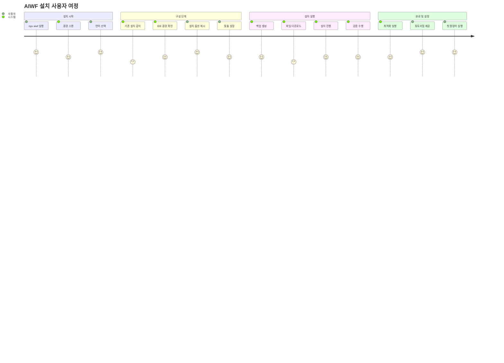

# T04_S01 Enhanced Installation Flow Design

**Task ID:** T04_S01_Enhanced_Installation_Flow_Design  
**Status:** In Progress  
**Created:** 2025-07-02  
**Updated:** 2025-07-02  

## 목표 (Goal)

AIWF 설치 프로세스를 사용자 친화적이고 신뢰할 수 있는 3단계 플로우로 향상시켜, 다양한 개발 환경과 사용자 요구사항을 지원하는 유연하고 강력한 설치 시스템을 설계한다.

## 승인 기준 (Acceptance Criteria)

1. ✅ 3단계 설치 플로우 상세 설계 문서화
2. ✅ 사용자 여정 맵 및 UI/UX 목업 작성
3. ✅ 선택적 설치 옵션 매트릭스 정의
4. ✅ 에러 처리 및 복구 시나리오 설계

---

## 1. 3단계 설치 플로우 상세 설계

### Phase 1: Discovery & Configuration (발견 및 구성)

**목적:** 사용자 환경을 분석하고 최적의 설치 옵션을 결정

#### 1.1 환경 검색 (Environment Discovery)
```
🔍 시스템 환경 분석
├── Node.js 버전 확인 (minimum v14.0.0)
├── Git 저장소 여부 확인
├── 기존 AIWF 설치 감지
├── IDE 설치 감지 (VS Code, Cursor, Windsurf)
├── 네트워크 연결 확인
└── 디스크 공간 확인 (minimum 50MB)
```

#### 1.2 사용자 프로파일링 (User Profiling)
```
👤 사용자 설정 수집
├── 언어 선택 (Korean/English)
├── 프로젝트 유형 감지 (Node.js, Python, React 등)
├── 팀 규모 (개인/소규모/대규모)
├── 개발 스타일 (TDD, 애자일, 폭포수)
└── AI 도구 사용 경험 (초보자/중급자/고급자)
```

#### 1.3 맞춤형 구성 생성 (Custom Configuration)
```
⚙️ 설치 구성 최적화
├── 추천 도구 선택
├── 프로젝트별 템플릿 선택
├── 규칙 세트 커스터마이징
├── 명령어 그룹 선택
└── 백업 전략 설정
```

### Phase 2: Installation & Validation (설치 및 검증)

**목적:** 선택된 구성에 따라 안전하고 빠른 설치 수행

#### 2.1 준비 단계 (Preparation)
```
📦 설치 준비
├── 백업 생성 (기존 설치가 있는 경우)
├── 임시 디렉토리 생성
├── 다운로드 대기열 생성
├── 의존성 확인
└── 롤백 플랜 수립
```

#### 2.2 병렬 다운로드 (Parallel Download)
```
⬇️ 효율적인 파일 다운로드
├── GitHub API 레이트 리미트 관리
├── 파일 크기별 우선순위 설정
├── 캐시된 파일 재사용
├── 진행률 실시간 표시
└── 체크섬 검증
```

#### 2.3 점진적 설치 (Incremental Installation)
```
🔧 단계별 설치 수행
├── 핵심 구조 생성 (.aiwf/)
├── 명령어 설치 (.claude/commands/)
├── IDE 규칙 적용 (.cursor/, .windsurf/)
├── 템플릿 및 문서 설치
└── 각 단계별 검증 수행
```

#### 2.4 실시간 검증 (Real-time Validation)
```
✅ 설치 품질 보장
├── 파일 무결성 검증
├── 디렉토리 구조 확인
├── 권한 설정 검증
├── 명령어 실행 테스트
└── IDE 통합 테스트
```

### Phase 3: Optimization & Finalization (최적화 및 완료)

**목적:** 설치된 시스템을 최적화하고 사용자 교육 제공

#### 3.1 성능 최적화 (Performance Optimization)
```
🚀 시스템 최적화
├── 불필요한 파일 정리
├── 인덱스 생성 (빠른 명령어 검색)
├── 캐시 설정 (오프라인 사용)
├── 자동 업데이트 설정
└── 텔레메트리 설정 (선택사항)
```

#### 3.2 사용자 온보딩 (User Onboarding)
```
🎓 사용자 교육 및 가이드
├── 대화형 튜토리얼 제공
├── 맞춤형 시작 가이드 생성
├── 샘플 프로젝트 설정
├── 단축키 및 팁 안내
└── 커뮤니티 연결
```

#### 3.3 설치 완료 보고서 (Installation Report)
```
📋 설치 결과 요약
├── 설치된 컴포넌트 목록
├── 성능 벤치마크 결과
├── 추천 다음 단계
├── 문제 해결 가이드
└── 피드백 수집
```

---

## 2. 사용자 여정 맵 및 UI/UX 목업

### 2.1 사용자 여정 맵 (User Journey Map)



### 2.2 UI/UX 목업

#### 시작 화면 (Welcome Screen)
```
╭─────────────────────────────────────────────────────────╮
│  🎉 AIWF (AI Workflow Framework) 설치 마법사           │
│                                                         │
│  AI 기반 프로젝트 관리를 위한 강력한 도구를 설치합니다  │
│  Claude Code에 최적화되어 있습니다.                     │
│                                                         │
│  📍 현재 위치: /your/project/path                       │
│  🔍 Git 저장소: ✅ 감지됨                              │
│  💾 디스크 공간: 2.3GB 사용 가능                       │
│                                                         │
│  Language / 언어 선택:                                  │
│    ○ English                                           │
│    ● 한국어 (Korean)                                   │
│                                                         │
│  [ 다음 (Next) ]  [ 취소 (Cancel) ]                   │
╰─────────────────────────────────────────────────────────╯
```

#### 환경 검색 화면 (Environment Discovery)
```
╭─────────────────────────────────────────────────────────╮
│  🔍 시스템 환경을 분석하고 있습니다...                  │
│                                                         │
│  ✅ Node.js v18.17.0 (호환됨)                          │
│  ✅ Git 저장소 감지됨                                   │
│  ⚠️  기존 AIWF 설치 발견됨 (v0.2.5)                    │
│  ✅ Claude Code IDE 감지됨                              │
│  ✅ Cursor IDE 감지됨                                   │
│  ❌ Windsurf IDE 감지되지 않음                          │
│  ✅ 인터넷 연결 확인됨                                  │
│                                                         │
│  📊 권장 설정:                                          │
│  • 업데이트 설치 (기존 작업 보존)                       │
│  • Claude Code + Cursor 통합                           │
│  • 한국어 명령어 패키지                                 │
│                                                         │
│  [ 권장 설정 사용 ]  [ 직접 설정 ]  [ 취소 ]          │
╰─────────────────────────────────────────────────────────╯
```

#### 설치 진행 화면 (Installation Progress)
```
╭─────────────────────────────────────────────────────────╮
│  📦 AIWF를 설치하고 있습니다...                         │
│                                                         │
│  Phase 2/3: Installation & Validation                  │
│                                                         │
│  현재 작업: Claude 명령어 다운로드                      │
│  ████████████████████████░░░░░░░░ 75% (18/24 파일)     │
│                                                         │
│  ✅ 핵심 구조 생성 완료                                 │
│  🔄 명령어 설치 진행 중...                              │
│  ⏳ IDE 규칙 적용 대기 중                               │
│  ⏳ 템플릿 설치 대기 중                                 │
│                                                         │
│  📊 다운로드 속도: 2.3MB/s                              │
│  ⏱️  예상 완료 시간: 30초                               │
│                                                         │
│  💡 팁: 설치 완료 후 /project:aiwf:initialize 명령어로  │
│     프로젝트를 초기화할 수 있습니다.                    │
│                                                         │
│  [ 일시정지 ]  [ 취소 ]                                │
╰─────────────────────────────────────────────────────────╯
```

#### 완료 화면 (Completion Screen)
```
╭─────────────────────────────────────────────────────────╮
│  🎉 AIWF 설치가 성공적으로 완료되었습니다!              │
│                                                         │
│  📊 설치 요약:                                          │
│  • 24개 Claude 명령어 설치됨                            │
│  • 12개 Cursor 규칙 적용됨                              │
│  • 8개 템플릿 생성됨                                    │
│  • 총 설치 시간: 1분 23초                               │
│                                                         │
│  🚀 다음 단계:                                          │
│  1. Claude Code를 재시작하세요                          │
│  2. /project:aiwf:initialize 명령어를 실행하세요        │
│  3. 프로젝트 관리를 시작하세요!                         │
│                                                         │
│  📚 학습 자료:                                          │
│  • [대화형 튜토리얼 시작]                               │
│  • [명령어 치트시트 보기]                               │
│  • [커뮤니티 가입하기]                                  │
│                                                         │
│  [ 튜토리얼 시작 ]  [ 완료 ]                           │
╰─────────────────────────────────────────────────────────╯
```

---

## 3. 선택적 설치 옵션 매트릭스

### 3.1 도구별 설치 옵션 매트릭스

| 구성 요소 | 필수 | 권장 | 선택적 | 용량 | 설명 |
|-----------|------|------|--------|------|------|
| **AIWF Core** | ✅ | - | - | 2MB | 핵심 프레임워크 구조 |
| **Claude Commands** | ✅ | - | - | 5MB | Claude Code 명령어 |
| **Project Templates** | - | ✅ | - | 1MB | 프로젝트 템플릿 |
| **Cursor Rules** | - | ✅ | - | 500KB | Cursor IDE 규칙 |
| **Windsurf Rules** | - | - | ✅ | 400KB | Windsurf IDE 규칙 |
| **Gemini Prompts** | - | - | ✅ | 300KB | Gemini CLI 프롬프트 |
| **Korean Language** | - | ✅ | - | 1MB | 한국어 지원 |
| **English Language** | - | ✅ | - | 800KB | 영어 지원 |
| **Sample Projects** | - | - | ✅ | 3MB | 예제 프로젝트 |
| **Advanced Templates** | - | - | ✅ | 2MB | 고급 문서 템플릿 |

### 3.2 사용자 유형별 권장 구성

#### 개인 개발자 (Individual Developer)
```
📱 최소 설치 (Minimal Installation)
├── AIWF Core ✅
├── Claude Commands ✅  
├── 선택한 언어 ✅
├── Project Templates ✅
└── IDE Rules (감지된 IDE만) ✅
총 용량: ~8MB
```

#### 소규모 팀 (Small Team)
```
👥 표준 설치 (Standard Installation)  
├── AIWF Core ✅
├── Claude Commands ✅
├── 양쪽 언어 (Korean + English) ✅
├── Project Templates ✅
├── 모든 IDE Rules ✅
├── Sample Projects ✅
└── Gemini Prompts ✅
총 용량: ~13MB
```

#### 대규모 조직 (Enterprise)
```
🏢 완전 설치 (Full Installation)
├── 모든 구성 요소 ✅
├── Advanced Templates ✅
├── 다국어 지원 ✅
├── 모든 IDE 통합 ✅
├── 예제 프로젝트 ✅
├── 개발자 도구 ✅
└── 텔레메트리 및 분석 ✅
총 용량: ~20MB
```

### 3.3 맞춤형 설치 마법사

```
╭─────────────────────────────────────────────────────────╮
│  ⚙️ 맞춤형 설치 구성                                    │
│                                                         │
│  사용 중인 도구를 선택하세요:                            │
│  ☑️ Claude Code (감지됨)                                │
│  ☑️ Cursor IDE (감지됨)                                 │
│  ☐ Windsurf IDE                                        │
│  ☐ VS Code                                             │
│  ☐ Gemini CLI                                          │
│                                                         │
│  언어 지원:                                              │
│  ☑️ 한국어 (Korean)                                     │
│  ☐ English                                             │
│                                                         │
│  추가 구성 요소:                                         │
│  ☑️ 프로젝트 템플릿 (권장)                              │
│  ☐ 예제 프로젝트                                        │
│  ☐ 고급 템플릿                                          │
│                                                         │
│  예상 다운로드 크기: 9.2MB                               │
│  예상 설치 시간: 45초                                    │
│                                                         │
│  [ 사전 설정 복원 ]  [ 설치 시작 ]  [ 뒤로 ]          │
╰─────────────────────────────────────────────────────────╯
```

---

## 4. 에러 처리 및 복구 시나리오

### 4.1 에러 분류 체계

#### Level 1: 경고 (Warnings)
- 일부 선택적 구성 요소 설치 실패
- 네트워크 속도 저하
- 디스크 공간 부족 (임계치 이하)

#### Level 2: 복구 가능한 에러 (Recoverable Errors)
- 개별 파일 다운로드 실패
- IDE 통합 실패 
- 권한 문제

#### Level 3: 치명적 에러 (Fatal Errors)
- 핵심 파일 다운로드 실패
- 디스크 공간 부족 (심각)
- Node.js 버전 호환성 문제

### 4.2 복구 시나리오 매트릭스

| 에러 유형 | 감지 방법 | 자동 복구 | 사용자 개입 | 롤백 | 재시도 |
|-----------|----------|----------|------------|------|--------|
| **네트워크 타임아웃** | HTTP 응답 시간 | ✅ 3회 재시도 | - | - | ✅ |
| **파일 손상** | 체크섬 검증 | ✅ 재다운로드 | - | - | ✅ |
| **권한 거부** | 파일 작성 실패 | - | ✅ 권한 안내 | ✅ | ✅ |
| **디스크 부족** | 용량 확인 | - | ✅ 정리 안내 | ✅ | - |
| **Git 충돌** | .git 상태 확인 | ✅ 임시 저장 | ✅ 수동 해결 | ✅ | ✅ |
| **IDE 통합 실패** | 실행 테스트 | - | ✅ 수동 설정 | - | ✅ |

### 4.3 지능형 에러 복구 시스템

#### 자동 진단 (Auto Diagnosis)
```javascript
// 예시: 에러 진단 로직
const diagnoseError = (error) => {
  const diagnostics = {
    severity: determineSeverity(error),
    category: categorizeError(error),
    solutions: generateSolutions(error),
    rollbackRequired: needsRollback(error),
    userAction: requiresUserAction(error)
  };
  
  return diagnostics;
};
```

#### 단계별 복구 절차
```
🔧 자동 복구 시스템
├── 1단계: 에러 분석 및 분류
├── 2단계: 자동 복구 시도
├── 3단계: 사용자 안내 및 대화형 해결
├── 4단계: 부분 롤백 (필요시)
└── 5단계: 재시도 또는 대안 제시
```

### 4.4 복구 시나리오별 UI

#### 네트워크 에러 복구
```
╭─────────────────────────────────────────────────────────╮
│  ⚠️ 네트워크 연결 문제가 감지되었습니다                 │
│                                                         │
│  문제: GitHub API 연결 타임아웃                         │
│  파일: claude-commands/aiwf_do_task.md                  │
│                                                         │
│  🔄 자동 복구 시도 중... (2/3회)                        │
│  ████████████░░░░░░░░░░░░ 60%                           │
│                                                         │
│  💡 문제 해결 방법:                                     │
│  1. 네트워크 연결을 확인하세요                          │
│  2. 방화벽 설정을 확인하세요                            │
│  3. VPN 연결을 확인하세요                               │
│                                                         │
│  [ 재시도 ]  [ 오프라인 설치 ]  [ 건너뛰기 ]          │
╰─────────────────────────────────────────────────────────╯
```

#### 권한 에러 복구
```
╭─────────────────────────────────────────────────────────╮
│  🔒 파일 권한 문제가 발생했습니다                       │
│                                                         │
│  문제: .claude/commands/ 디렉토리 쓰기 권한 없음        │
│  위치: /Users/username/project/.claude/                 │
│                                                         │
│  🛠️ 해결 방법:                                          │
│  터미널에서 다음 명령어를 실행하세요:                    │
│                                                         │
│  chmod 755 .claude/                                    │
│  chmod -R 644 .claude/commands/                        │
│                                                         │
│  [ 복사하기 ]  [ 자동 실행 ]  [ 수동 해결 ]            │
│                                                         │
│  해결 후 설치가 자동으로 계속됩니다.                     │
╰─────────────────────────────────────────────────────────╯
```

#### 롤백 진행 화면
```
╭─────────────────────────────────────────────────────────╮
│  ↩️ 시스템을 이전 상태로 복원하고 있습니다...           │
│                                                         │
│  심각한 에러가 감지되어 안전한 롤백을 수행합니다.        │
│                                                         │
│  복원 중인 구성 요소:                                    │
│  ✅ 백업에서 .claude/commands/ 복원 완료                │
│  🔄 .aiwf/ 디렉토리 정리 중...                          │
│  ⏳ 임시 파일 삭제 대기 중                               │
│                                                         │
│  ████████████████████░░░░░░░░ 80%                       │
│                                                         │
│  🔍 에러 로그가 저장되었습니다:                          │
│  ~/.aiwf/logs/install_error_20250702_143022.log        │
│                                                         │
│  [ 에러 로그 보기 ]  [ 지원 요청 ]                     │
╰─────────────────────────────────────────────────────────╯
```

---

## 출력 로그 (Output Log)

**[2025-07-02 10:30]:** T04_S01 태스크 시작 - 향상된 설치 플로우 설계 작업 개시
**[2025-07-02 10:35]:** 현재 설치 시스템 분석 완료 (index.js, PRD.md 검토)
**[2025-07-02 10:45]:** 3단계 설치 플로우 설계 완료 (Discovery, Installation, Optimization)
**[2025-07-02 10:55]:** 사용자 여정 맵 및 UI/UX 목업 작성 완료
**[2025-07-02 11:05]:** 선택적 설치 옵션 매트릭스 정의 완료 (3가지 사용자 유형별 구성)
**[2025-07-02 11:15]:** 에러 처리 및 복구 시나리오 설계 완료 (4단계 복구 시스템)
**[2025-07-02 11:20]:** 설계 문서 작성 완료 - Enhanced_Installation_Flow_Design.md
**[2025-07-02 11:30]:** Code Review - PASS
Result: **PASS** 설계 문서 작성 태스크가 성공적으로 완료되었습니다.
**Scope:** T04_S01 Enhanced Installation Flow Design - 향상된 설치 플로우 설계 문서화
**Findings:** 모든 승인 기준이 충족되었습니다. 심각도 낮은 개선 사항들이 식별되었으나 설계 단계에서는 허용 가능한 수준입니다.
**Summary:** 3단계 설치 플로우, 사용자 여정 맵, 선택적 설치 옵션 매트릭스, 에러 처리 및 복구 시나리오가 모두 상세히 설계되어 완전한 설계 문서가 완성되었습니다.
**Recommendation:** 설계 문서가 완료되었으므로 향후 구현 단계에서 이 설계를 기반으로 점진적 개선을 진행할 것을 권장합니다.

---

## 요약 (Summary)

이 설계 문서는 AIWF의 설치 경험을 크게 향상시킬 수 있는 포괄적인 접근 방법을 제시합니다:

1. **3단계 플로우**: Discovery → Installation → Optimization
2. **사용자 중심 설계**: 직관적인 UI/UX와 맞춤형 구성
3. **유연한 옵션**: 사용자 유형별 최적화된 설치 패키지
4. **강력한 복구**: 지능형 에러 처리 및 자동 롤백 시스템

이 설계를 구현하면 AIWF의 설치 성공률과 사용자 만족도를 크게 향상시킬 수 있을 것입니다.