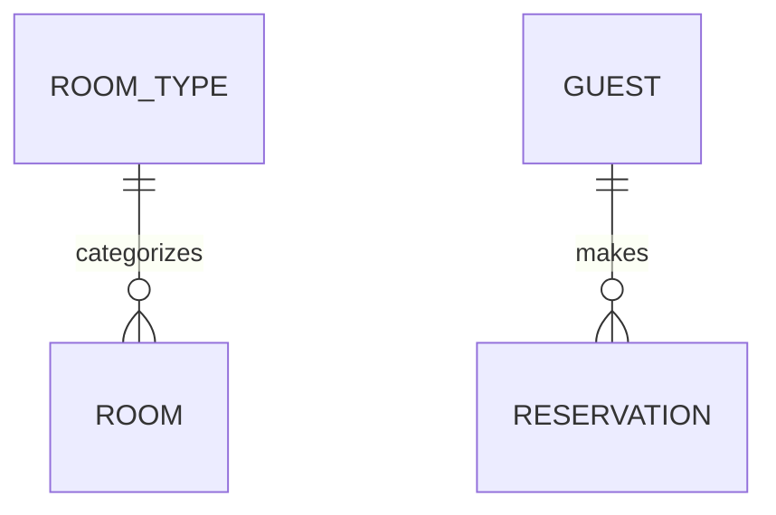

# 엔티티 모델

> 휴먼 리뷰용 한글 번역입니다. 실행 원문: [원문](../../../../../plugins/aiwf-core/skills/entity-model/SKILL.md). 번역과 자동 검사는 승인을 뜻하지 않으며, 검토 상태와 원문 SHA256은 [관리 목록](../../../manifest.json)에서 확인합니다.

- 식별자: `entity-model`
- 설명: Mermaid.js ER 다이어그램과 속성 표로 엔티티, 관계, 데이터 타입, 검증 규칙을 정의하는 엔티티 모델 문서를 생성합니다. 사용자가 "엔티티 모델 생성", "데이터 모델 설계", "ERD 그리기", "데이터베이스 스키마 정의", "엔티티 모델링"을 요청하거나 엔티티-관계 다이어그램, ER 다이어그램, 데이터베이스 설계, 데이터 모델링을 언급할 때 사용합니다. 또한 요구사항 카탈로그로부터 엔티티 모델 또는 데이터 모델 문서(예: docs/entity_model.md)를 만들거나 작성하거나 설계하는 작업, 이를테면 "데이터 모델 설계", "개발 전에 팀에 엔티티 모델이 필요하다" 같은 표현이나 속성·데이터 타입·정밀도·검증·속성 간 제약을 문서화해 달라는 요청에서도 트리거됩니다.

<!--
Copyright 2025-2026 Simon Martinelli and the AI Unified Process contributors.
Part of the AI Unified Process — https://unifiedprocess.ai
Licensed under the Apache License, Version 2.0. See LICENSE and NOTICE.
-->

## 지침

`docs/requirements.md`를 바탕으로 `docs/entity_model.md`에 엔티티 모델을 생성하거나 갱신합니다.
이 문서는 ER 다이어그램과 속성 표를 담습니다.

## 하지 말 것

- Mermaid 다이어그램에 속성/열을 추가하지 않습니다
- "Key attributes: name, email..." 같은 산문 설명을 쓰지 않습니다
- "Relationships" 표를 만들지 않습니다

## 문서 구조

아래는 생성할 문서가 따라야 할 구조 예시입니다. 원문의 바깥 코드 펜스가 닫히지 않아 뒤의 지시까지 코드로 흡수하므로, 검토본은 `## Required Format for Each Entity` 직전에 예시를 닫았습니다. 예시 안의 영어와 표 구조는 그대로 유지했습니다. `### ENTITY_NAME` 이하 블록은 엔티티 절의 형식을 보여 주는 예시입니다. 표의 열은 왼쪽부터 Attribute(속성), Description(설명), Data Type(데이터 타입), Length/Precision(길이/정밀도), Validation Rules(검증 규칙)이며, `...`은 채워 넣을 자리입니다.

````markdown
# Entity Model

## Entity Relationship Diagram



### ENTITY_NAME

One sentence describing the entity.

| Attribute | Description | Data Type | Length/Precision | Validation Rules      |
|-----------|-------------|-----------|------------------|-----------------------|
| id        | ...         | Long      | 19               | Primary Key, Sequence |
| ...       | ...         | ...       | ...              | ...                   |
````

## Required Format for Each Entity

모든 엔티티는 반드시 다음을 갖추어야 합니다:

1. 엔티티 이름을 대문자(UPPER_SNAKE_CASE)로 쓴 `###` 헤딩(예: `### ROOM_TYPE` — `### Room Type` 또는 `## Entity: Room Type`은 안 됩니다)
2. 한 문장 설명
3. 정확히 다음 5개 열을 이 순서로 가진 속성 표: Attribute, Description, Data Type, Length/Precision, Validation Rules

### 예시 엔티티

### ROOM_TYPE

Defines categories of rooms with shared characteristics.

| Attribute   | Description              | Data Type | Length/Precision | Validation Rules          |
|-------------|--------------------------|-----------|------------------|---------------------------|
| id          | Unique identifier        | Long      | 19               | Primary Key, Sequence     |
| name        | Name of the room type    | String    | 50               | Not Null, Unique          |
| description | Detailed description     | String    | 500              | Optional                  |
| capacity    | Maximum number of guests | Integer   | 10               | Not Null, Min: 1, Max: 10 |
| price       | Price per night in CHF   | Decimal   | 10,2             | Not Null, Min: 0          |

위 `### ROOM_TYPE` 예시는 형식을 보여 주기 위해 원문을 유지했고, 각 행의 한국어 뜻과 검증 규칙 값은 아래와 같습니다:

- `id` — 고유 식별자 (Long, 길이 19, Primary Key, Sequence)
- `name` — 객실 유형 이름 (String, 길이 50, Not Null, Unique)
- `description` — 상세 설명 (String, 길이 500, Optional)
- `capacity` — 최대 수용 인원 (Integer, 10, Not Null, Min: 1, Max: 10)
- `price` — 1박당 가격(스위스 프랑, CHF) (Decimal, 10,2, Not Null, Min: 0)

데이터 타입 값과 검증 규칙 값은 아래 표의 어휘를 따릅니다.

## Mermaid 다이어그램 규칙

- 엔티티 이름과 관계만 표시합니다
- 엔티티 블록 안에 속성을 넣지 않습니다
- 관계 문법을 사용합니다: `ENTITY_A ||--o{ ENTITY_B : "relationship"`

## 데이터 타입 (이것만 사용)

Data Type 열은 정확히 다음 값만 사용해야 하며, VARCHAR, TEXT, CHAR, bigint, numeric, serial, smallint, UUID, Timestamp, Enum 같은 SQL 또는 ORM 타입은 절대 쓰지 않습니다:

| Data Type | Length/Precision | Usage                 |
|-----------|------------------|-----------------------|
| Long      | 19               | ID, 외래 키            |
| String    | varies (50-500)  | 텍스트 필드            |
| Integer   | 10               | 정수                   |
| Decimal   | 10,2             | 통화, 백분율           |
| Boolean   | 1                | 참/거짓 플래그         |
| Date      | -                | 날짜만                 |
| DateTime  | -                | 날짜와 시간            |

Length/Precision 열에는 값만 적습니다(예: `10,2`). `DECIMAL(10,2)` 같은 타입 표현식은 절대 쓰지 않습니다.

## 검증 규칙 (이 값만 사용)

모든 Validation Rules 셀은 다음 어휘에서, 정확한 표현 그대로 구성합니다. 산문 설명도, 빈 셀도, 대시도, "N/A"도 안 됩니다:

| Attribute Type                | Validation Rules Value              |
|-------------------------------|-------------------------------------|
| 기본 키                        | Primary Key, Sequence               |
| 자연 키 또는 복합 키            | Primary Key                         |
| 복합 키이면서 외래 키           | Primary Key, Foreign Key (TABLE.id) |
| 필수 필드                      | Not Null                            |
| 고유 필드                      | Not Null, Unique                    |
| 외래 키                        | Not Null, Foreign Key (TABLE.id)    |
| 선택 필드                      | Optional                            |
| 범위 지정                      | Not Null, Min: X, Max: Y            |
| 값 목록                        | Not Null, Values: A, B, C           |
| 이메일                         | Not Null, Format: Email             |

예: 이메일 속성은 `Not Null, Format: Email`이며, "must be a valid email address"가 아닙니다. 상태 값 집합이 고정된 속성은 `Not Null, Values: Pending, Active, Completed, Cancelled`이며, "must be one of Pending, Active, Completed, Cancelled"가 아닙니다.

이 표는 **닫힌 집합**입니다. 모든 Validation Rules 셀은 이 표의 행 하나와 정확히 일치합니다. 행을 조합해 새 패턴을 만들지 말고(`Not Null, Unique, Format: Email`은 잘못된 예입니다 — 가장 중요한 규칙 하나를 골라 여기서는 `Not Null, Format: Email`을 씁니다), 짝이 되는 `Max:` 없이 `Min:`을 쓰지 않습니다(`Not Null, Min: 0`만 쓰는 것은 잘못된 예입니다 — `Not Null, Min: 0, Max: <upper bound>`처럼 상한 자리를 채우거나 그냥 `Not Null`을 씁니다).

같은 표가 [references/REFERENCE.md](../../../../../plugins/aiwf-core/skills/entity-model/references/REFERENCE.md)([한글 검토본](references/REFERENCE.ko.md))에도 있습니다. 이 경로는 프로젝트 루트가 아니라 이 SKILL.md가 있는 폴더 기준입니다.

## 다중 열 제약

검증이 여러 열에 걸치면 표 뒤에 다음을 추가합니다:

**Constraints:** Check-out date must be after check-in date.

위 `**Constraints:**` 예시의 뜻은 "체크아웃 날짜는 체크인 날짜 이후여야 한다"입니다.

## 워크플로

1. 요구사항 문서를 읽습니다
2. TodoWrite로 엔티티마다 작업을 만듭니다
3. 문서 헤더와 ER 다이어그램(관계만)을 작성합니다
4. 각 엔티티에 대해:
    - `###` 헤딩을 씁니다
    - 한 문장 설명을 씁니다
    - 5개 열을 가진 속성 표를 씁니다
    - 필요하면 제약을 추가합니다
    - 할 일을 완료로 표시합니다
5. 문서를 검증합니다:
    - ER 다이어그램의 모든 엔티티에 대응하는 속성 표 절이 있어야 합니다
    - 모든 속성 표가 정확히 5개 열을 가져야 합니다
    - Mermaid 다이어그램 엔티티 블록 안에 속성이 나타나지 않아야 합니다
    - 모든 외래 키가 존재하는 엔티티를 참조해야 합니다
    - 모든 외래 키에 ER 다이어그램의 관계 선이 있어야 합니다
    - 모든 엔티티 헤딩이 이름을 대문자로 쓴 `###`여야 합니다
    - 모든 Data Type 값이 위 데이터 타입 표에서 와야 합니다(어디에도 SQL 타입이 없어야 합니다)
    - 모든 검증 규칙이 위 검증 규칙 표의 값을 사용해야 합니다
