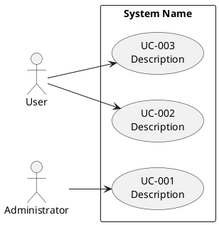

# 유스케이스 다이어그램

> 휴먼 리뷰용 한글 번역입니다. 실행 원문: [원문](../../../../../plugins/aiwf-core/skills/use-case-diagram/SKILL.md). 번역과 자동 검사는 승인을 뜻하지 않으며, 검토 상태와 원문 SHA256은 [관리 목록](../../../manifest.json)에서 확인합니다.

- 식별자: `use-case-diagram`
- 설명: 요구사항으로부터 액터, 유스케이스, 그 관계를 정의하는 PlantUML 유스케이스 다이어그램을 생성하거나 갱신합니다. 사용자가 "유스케이스 다이어그램 생성", "UML 다이어그램 그리기", "액터를 유스케이스에 매핑", ".puml 파일 생성"을 요청하거나 PlantUML, 유스케이스 개요, 액터 다이어그램, 시스템 유스케이스를 언급할 때 사용합니다.

<!--
Copyright 2025-2026 Simon Martinelli and the AI Unified Process contributors.
Part of the AI Unified Process — https://unifiedprocess.ai
Licensed under the Apache License, Version 2.0. See LICENSE and NOTICE.
-->

## 지침

`docs/requirements.md`를 바탕으로 `docs/use_cases.puml`에 PlantUML 유스케이스 다이어그램을 생성하거나 갱신합니다.

## 하지 말 것

- 요구사항을 먼저 읽지 않고 다이어그램을 만들지 않습니다
- 비표준 PlantUML 문법을 사용하지 않습니다
- 유스케이스 이름에 구현 세부사항을 넣지 않습니다
- 데이터 검증, 로딩, 저장 같은 기술적 단계를 별도 유스케이스로 모델링하지 않습니다("목표 수준" 참고)

## 템플릿

아래 PlantUML 블록은 원문을 그대로 보존했습니다.

## 목표 수준

다이어그램의 모든 유스케이스는 **사용자 목표**입니다. Cockburn이 말한 해수면(sea level)으로, 하나의 액터가 한 자리에서 수행하고 주 액터가 성과를 가지고 떠나는 결과입니다. 각 유스케이스를 다음 한 가지 질문으로 검사합니다:

> 이 유스케이스가 주 액터가 가치 있다고 인식할 완전한 목표인가?

- **너무 낮음(하위 기능):** 더 큰 목표의 한 단계이며, 흔히 기술적인 단계입니다 — "Validate METAR", "Load NOTAM", "Persist Result". 관제사는 METAR을 검증하려고 자리에 앉지 않습니다. 그들은 공항이 적합한지 알고 싶어 합니다. 그런 단계는 그것이 봉사하는 사용자 목표("Determine Airport Suitability")로 접어 넣고, 그 목표의 주 성공 시나리오 단계로 만듭니다. 하위 기능을 독립 유스케이스로 유지하는 것은 여러 사용자 목표가 그것을 공유할 때뿐이며, 그때는 각 목표에서 `<<include>>`로 그립니다.
- **너무 높음(요약):** 여러 자리에 걸친 작업 영역 전체입니다 — "Manage Flight Operations". 그것을 구성하는 사용자 목표로 나눕니다. 유스케이스는 흐름이 작업을 다른 역할로 넘기거나, 외부 이벤트나 기한을 기다리거나, 서로 다른 액터를 위해 분기를 병렬로 실행할 때도 요약입니다 — 서기, 심사자, 승인 후 지급을 포함하는 "Process Insurance Claim" 같은 경우입니다. 각 역할의 몫은 그 자체로 사용자 목표이고, 이들을 연결하는 흐름은 `docs/processes/`에 BPMN으로 모델링하는 비즈니스 프로세스이며, 그 활동이 바로 이 유스케이스들이고 `/test-case`가 여기서 테스트 케이스를 도출합니다. 유스케이스 안에 프로세스를 설명하거나 프로세스 모델을 붙이지 않습니다.

목표가 아니라 단계를 설명하는 기능 요구사항은 그 단계를 포함하는 사용자 목표 유스케이스로 추적됩니다.

## 관례

- 각 유스케이스는 고유한 id와 설명을 가집니다
- 유스케이스 ID: UC-{3-digit} (UC-001, UC-002, ...)
- 각 유스케이스는 최소 하나의 기능 요구사항으로 추적되어야 합니다
- 보조 액터(지원 역할과 결제나 날씨 서비스 같은 외부 시스템)도 액터로 그려지고 자신이 지원하는 유스케이스에 연결됩니다. 이들은 유스케이스 명세에 `**Secondary Actors:**`로 나타납니다
- 노트는 관계를 명확히 해야 할 때만 드물게 추가합니다

## 워크플로

1. `docs/requirements.md`의 요구사항을 읽습니다
2. `docs/use_cases.puml`의 기존 다이어그램을 읽습니다(있으면)
3. 요구사항에서 액터와 유스케이스를 식별합니다
4. 모든 유스케이스를 "목표 수준"의 질문에 비추어 검사합니다: 하위 기능은 그것이 봉사하는 사용자 목표로 접어 넣고, 요약 목표는 나누고, 어떤 유스케이스를 합치거나 나눴는지와 그 이유를 사용자에게 알립니다
5. PlantUML 유스케이스 다이어그램을 생성/갱신합니다
6. 다이어그램을 검증합니다:
    - 각 유스케이스는 사용자 목표입니다("목표 수준" 참고). 하위 기능은 여러 유스케이스가 공유하는 `<<include>>`로만 나타납니다
    - 각 유스케이스는 `docs/requirements.md`의 최소 하나의 기능 요구사항으로 추적됩니다
    - 모든 액터가 최소 하나의 유스케이스에 연결됩니다
    - 유스케이스 ID가 UC-{3-digit} 관례를 따릅니다
    - PlantUML 문법이 유효합니다(`@enduml` 누락 없음, 올바른 화살표 문법)
