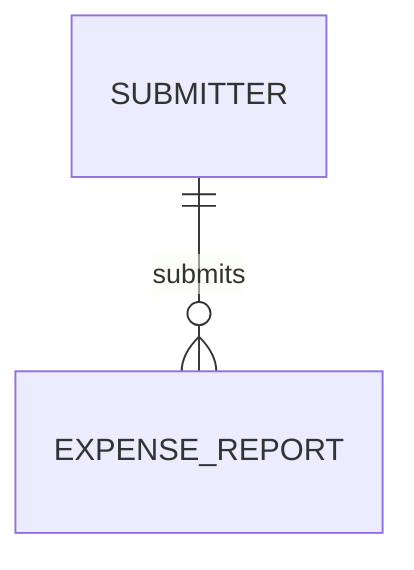

# Entity Model

> Status: Draft

## Entity Relationship Diagram

### SUBMITTER

지출 내역을 제출하는 사람을 나타낸다.

| Attribute | Description        | Data Type | Length/Precision | Validation Rules      |
|-----------|--------------------|-----------|------------------|-----------------------|
| id        | 제출자 고유 식별자 | Long      | 19               | Primary Key, Sequence |
| name      | 제출자 이름        | String    | 100              | Not Null              |

### EXPENSE_REPORT

제출된 지출 내역 한 건을 나타낸다.

| Attribute    | Description      | Data Type | Length/Precision | Validation Rules                    |
|--------------|------------------|-----------|------------------|-------------------------------------|
| id           | 지출 내역 식별자 | Long      | 19               | Primary Key, Sequence               |
| amount       | 제출 금액        | Decimal   | 10,2             | Not Null, greater than 0  |
| description  | 사용 내용        | String    | 200 code points  | Optional; BR-002                    |
| submitted_at | 제출 시각        | DateTime  | -                | Not Null                            |
| submitter_id | 제출자 참조      | Long      | 19               | Not Null, Foreign Key (SUBMITTER.id) |

**Constraints:** 지출 내역의 금액은 0보다 커야 한다. 사용 내용은 Unicode code point 200개 이하여야 하며 생략·null은 빈 문자열로 정규화한다 (UC-001 BR-002). 실제 DB와 업무 정책은 이번 서비스 파일럿에서 검증하지 않는다.
