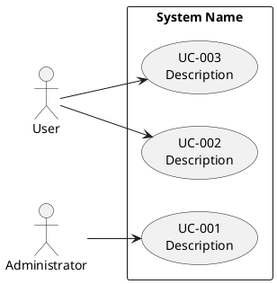

<!--
Copyright 2025-2026 Simon Martinelli and the AI Unified Process contributors.
Part of the AI Unified Process — https://unifiedprocess.ai
Licensed under the Apache License, Version 2.0. See LICENSE and NOTICE.
-->

# Use Case Diagram

## Instructions

Create or update the PlantUML use case diagram at `docs/use_cases.puml` based on `docs/requirements.md`.

## DO NOT

- Create diagrams without reading the requirements first
- Use non-standard PlantUML syntax
- Include implementation details in use case names
- Model technical steps such as validating, loading, or persisting data as separate use cases (see "Goal level")

## Template

## Goal level

Every use case in the diagram is a **user goal** — what Cockburn calls the sea level: one actor, one sitting, a
result the primary actor walks away with. Test each use case with one question:

> Is this use case a complete goal that the primary actor would recognize as valuable?

- **Too low (subfunction):** a step of a larger goal, often a technical one — "Validate METAR", "Load NOTAM",
  "Persist Result". No dispatcher sits down to validate a METAR; they want to know whether an airport is suitable.
  Fold such steps into the user goal they serve ("Determine Airport Suitability"), where they become steps of its
  main success scenario. Keep a subfunction as its own use case only when several user goals share it, and then draw
  it with `<<include>>` from each of them.
- **Too high (summary):** a whole area of work that spans many sittings — "Manage Flight Operations". Split it into
  the user goals it is made of. A use case is a summary, too, when its flow hands the work over to another role,
  waits for an outside event or a deadline, or runs branches in parallel for different actors — "Process Insurance
  Claim" with a clerk, an assessor, and a payout after approval. Each role's part is a user goal of its own; the
  flow that connects them is a business process, modeled in BPMN in `docs/processes/`, whose activities are those
  use cases and from which `/test-case` derives the test cases. Do not describe the process inside a use case or
  attach a process model to it.

A functional requirement that describes a step rather than a goal traces to the user goal use case that contains
the step.

## Conventions

- Each use case has a unique id and a description
- Use Case ID: UC-{3-digit} (UC-001, UC-002, ...)
- Each use case should trace to at least one functional requirement
- Secondary actors (supporting roles and external systems such as a payment or weather service) are drawn as
  actors too and connected to the use cases they support; they appear as `**Secondary Actors:**` in the use case
  specification
- Add notes sparingly, only where relationships need clarification

## Workflow

1. Read the requirements at `docs/requirements.md`
2. Read existing diagram at `docs/use_cases.puml` (if exists)
3. Identify actors and use cases from requirements
4. Check every use case against the question in "Goal level": fold subfunctions into the user goal they serve,
   split summary goals, and tell the user which use cases you merged or split and why
5. Create/update the PlantUML use case diagram
6. Validate the diagram:
    - Each use case is a user goal (see "Goal level"); a subfunction appears only as an `<<include>>` shared by
      several use cases
    - Each use case traces to at least one functional requirement in `docs/requirements.md`
    - All actors are connected to at least one use case
    - Use case IDs follow the UC-{3-digit} convention
    - PlantUML syntax is valid (no missing `@enduml`, proper arrow syntax)