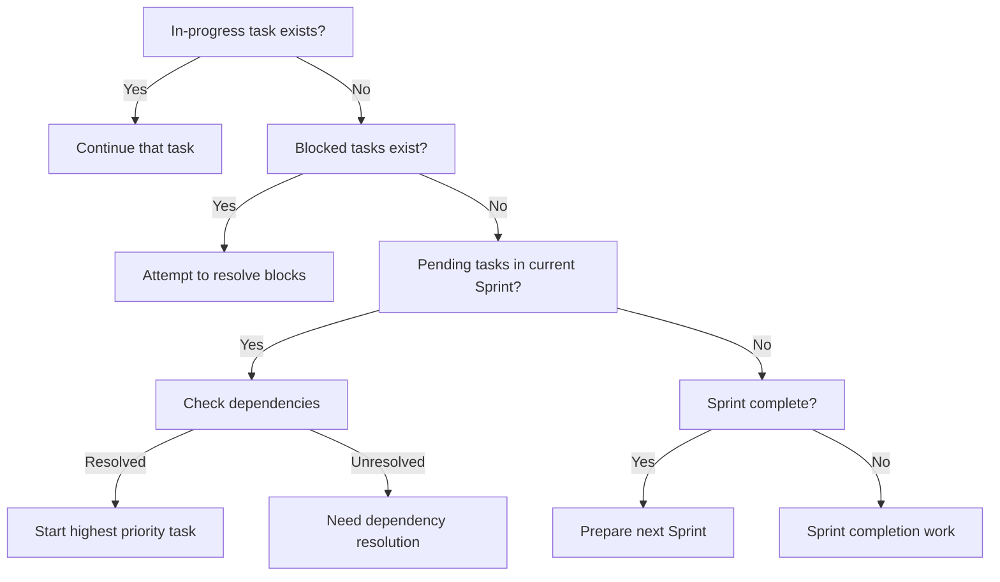

# Smart Next Action Decision

Analyze workflow rules and current state to determine the optimal next action for AI to perform. Rather than simply listing tasks, suggest the most effective work within the full project context.

## Core Features

- **Workflow Compliance**: Respect Milestone → Sprint → Task hierarchy
- **Dependency Resolution**: Suggest only executable tasks
- **Priority Calculation**: Multi-dimensional score-based optimal task selection
- **Automatic Transition**: Appropriate transition suggestions at Sprint/Milestone boundaries

## Execution Process

### 1. Load and Analyze Context

**Collect Required Data:**
```javascript
// 1. Load current state
const stateIndex = loadStateIndex();
const workflowRules = loadWorkflowRules();
const currentContext = loadWorkflowContext();

// 2. Identify current position
const position = {
  milestone: "M01",
  sprint: "S02", 
  activeTasks: ["T03_S02_M01"],
  phase: "implementation"
};
```

### 2. Executability Analysis

**Verification for Each Pending Task:**

```javascript
for (const task of pendingTasks) {
  const canExecute = checkExecutability(task);
  
  // Executability checklist
  canExecute.sameSprint = (task.sprint === currentSprint);
  canExecute.dependenciesMet = checkDependencies(task);
  canExecute.resourcesAvailable = checkResources(task);
  canExecute.noBlockers = !hasBlockers(task);
  
  if (canExecute.all()) {
    executableTasks.push(task);
  }
}
```

### 3. Priority Score Calculation

**Multi-dimensional Priority Matrix:**

```
Score = (Priority × 3) + (Dependencies × 2) + (Sprint Goal × 2) + (Urgency × 1)

Example:
T04: (High × 3) + (Blocking × 2) + (Critical × 2) + (Soon × 1) = 9 + 6 + 6 + 2 = 23 points
T05: (Medium × 2) + (Dependent × 1) + (Important × 2) + (Later × 1) = 6 + 2 + 4 + 1 = 13 points
```

### 4. Execute Decision Tree

**Systematic Decision Process:**



### 5. Generate Context-based Recommendations

**Situation-specific Recommendations:**

#### Case 1: Task In Progress
```markdown
## 🎯 Recommendation: Focus on Current Task Completion

**Primary Work**: T03_S02_M01 - User Auth API Implementation (45% complete)

**Next Steps**:
1. Implement register endpoint validation (1.5 hours)
2. Add error handling logic (1 hour)
3. Write unit tests (2 hours)

**Completion Effects**:
- Enables T04, T05 start (dependency resolution)
- Sprint S02 progress 40% → 70%
- Unblocks core functionality

**Recommended Focus Time**: 4-5 hours concentrated work to complete
```

#### Case 2: Sprint Transition Needed
```markdown
## 🔄 Recommendation: Sprint Transition Preparation

**Current Situation**: S02 complete (100%), S03 unprepared

**Immediate Actions**:
1. Write S02 Sprint review document (30 min)
2. Integration test completed features (1 hour)
3. Analyze S03 requirements (1 hour)

**S03 Preparation Work**:
1. Develop test plan
2. Break down and create tasks
3. Resource allocation planning

**Auto-execute**: /aiwf:transition S02 → S03
```

#### Case 3: Parallel Execution Possible
```markdown
## ⚡ Recommendation: Parallel Task Execution

**Concurrently Executable Tasks**:
- T06: Frontend login form (independent)
- T07: API documentation (independent)
- T08: Database index optimization (independent)

**Execution Strategy**:
1. Primary: T06 (development focus)
2. Secondary: T07 (documentation in spare time)
3. Background: T08 (automated scripts)

**Expected Time Savings**: Sequential 12 hours → Parallel 6 hours
```

### 6. Obstacle and Risk Analysis

**Proactive Problem Solving:**

```markdown
## ⚠️ Attention Required

### Immediate Resolution Needed
1. **T09 Blocked**: API permission issue
   - Solution: Request admin permissions
   - Expected delay: 1-2 days

### Potential Risks
1. **S03 Tasks Not Created**
   - Risk: Sprint start delay
   - Action: Prepare at S02 80% point

2. **M01 Deadline Approaching**
   - Remaining: 10 days
   - Required work: 15 Tasks
   - Recommendation: Target 2 tasks/day

### Dependency Chain
T03 → T04 → T05 → T10
- T03 delay impacts entire chain
- Buffer time needed
```

### 7. Generate Execution Plan

**Concrete Execution Roadmap:**

```markdown
## 📋 Execution Plan

### Today (Day 1)
- [ ] 09:00-11:00: Complete T03 register endpoint
- [ ] 11:00-12:00: T03 unit tests
- [ ] 14:00-15:00: T03 code review and finalization
- [ ] 15:00-17:00: Start T04 (API documentation)

### Tomorrow (Day 2)
- [ ] Complete T04
- [ ] Start T05
- [ ] S03 planning meeting

### Weekly Goals
- [ ] Complete S02 (current 40% → 100%)
- [ ] Create S03 tasks and reach 30% progress
- [ ] M01 overall progress 70% → 85%
```

## Output Format

```
🤖 Analyzing smart next action...

📊 Current Situation Analysis:
- Location: M01 > S02 > T03
- In Progress: 1 Task (T03)
- Pending: 4 Tasks
- Executable: 1 Task

🎯 Top Priority Recommendations:

1️⃣ Complete T03 (Priority: 🔴 High)
   📍 Current: Implementing register endpoint
   ⏱️ Estimated: 4 hours
   🎯 Goal: Complete core API functionality
   💡 Reason: 3 tasks waiting on this

2️⃣ Prepare T04 (Priority: 🟡 Medium)
   📍 Condition: After T03 completion
   ⏱️ Estimated: 3 hours
   🎯 Goal: API documentation
   💡 Reason: Enables frontend development

3️⃣ Plan S03 (Priority: 🟢 Low)
   📍 Condition: S02 at 80% completion
   ⏱️ Estimated: 2 hours
   🎯 Goal: Test Sprint preparation
   💡 Reason: Prevent Sprint transition delay

⚡ Parallelizable: T07 (documentation)

⚠️ Caution: T05 requires T04 completion

📈 Expected Impact:
- Sprint progress: 40% → 70%
- Unblock: 3 tasks
- Schedule adherence: 95%
```

## Advanced Features

### 1. Learning-based Recommendations
```javascript
// AI work pattern learning
const patterns = {
  preferredWorkingHours: "10:00-14:00",
  averageTaskCompletion: "4.5 hours",
  strongSkills: ["backend", "api"],
  improvementAreas: ["frontend", "testing"]
};

// Pattern-based recommendation adjustment
recommendations.adjust(patterns);
```

### 2. Risk-based Priority
```javascript
// Add risk score
riskScore = impactIfDelayed × probabilityOfDelay;
finalScore = priorityScore + (riskScore × 0.5);
```

### 3. Team Collaboration Consideration
```javascript
// Consider other team members' work
if (teamMember.working_on === "frontend") {
  prioritize("backend_tasks");
  suggest("api_documentation"); // Support collaboration
}
```

## Usage Scenarios

### 1. Daily Work Start
```bash
# Morning work start
/aiwf:update_state
/aiwf:workflow_context
/aiwf:next_action
# → Provides optimal work order for today
```

### 2. After Task Completion
```bash
# Complete task
/aiwf:complete_task T03

# Decide next work
/aiwf:next_action
# → Suggests new work with resolved dependencies
```

### 3. Weekly Planning
```bash
# Weekly planning
/aiwf:next_action --timeline week
# → Generates weekly work plan
```

## Related Commands

- `/aiwf:workflow_context` - Load workflow context
- `/aiwf:do_task` - Execute recommended task
- `/aiwf:transition` - Sprint/Milestone transition
- `/aiwf:update_state` - Update state

This command helps AI select the most effective work within the full project context, rather than simply listing tasks.